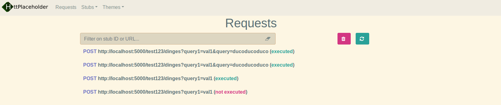

# HttPlaceholder


| | |
| --- | --- |
| **Build** | [](https://ci.appveyor.com/project/dukeofharen/httplaceholder) |
| **License** | [](https://opensource.org/licenses/MIT) |

Quickly mock away any webservice using HttPlaceholder. HttPlaceholder lets you specify what the request should look like and what response needs to be returned.

# Where?
* [Download the latest release](https://github.com/dukeofharen/httplaceholder/releases/latest)
* Install as dotnet tool:<br />
`dotnet install --global httplaceholder`
* [Issue tracking on Trello](https://trello.com/b/PCZ6K9Hd/httplaceholder)

# Why?
At my current job, we develop and maintain a lot of web applications. These web applications have a lot of dependencies on other web services. So I thought: instead of running all these dependent web services on the local dev machine, why not use a stub to make development easier? That's exactly what I did.

So a few bullet points in a row:

🐱‍👤 Define all the needed requests in a YAML file, which can also be checked in for all your team members to use.<br />
🏄‍ Many request conditions take regular expressions, to make your stub even more flexible.<br />
😴 Use the HttPlaceholder REST API to prepare all the requests you need for automated tests.<br />

# How?
You have an input YAML file (which contains 1 or more requests):

```yml
- id: situation-01
  conditions:
    method: GET
    url:
      path: /users
      query:
        id: 12
        filter: first_name
  response:
    statusCode: 200
    text: |
      {
        "first_name": "John"
      }
    headers:
      Content-Type: application/json
```

In the `conditions` element, you specify which conditions the request should apply to.
- The method should be `GET`.
- The path of your URL should be '/users'.
- The query parameters `id` and `filter` should be there with the values `12` and `first_name` respectively.

In this case, if you go to the URL http://localhost:5000/users?id=12&filter=first_name, you get the response as defined.

The `response` element defines the response of the request. In this case, HTTP 200 is returned, the literal JSON string defined and `application/json` as Content-Type header. Also take a look at the [samples](docs/SAMPLES.md).

Go to `http://localhost:5000/ph-ui`, you will get to the management interface to see all made requests and all stubs.



# Batteries included 🔋
- XPath conditions.
- JSONPath conditions.
- Request header conditions.
- Many conditions also take regular expressions.
- Basic authentication conditions.
- Add Base64 and file references to your response, so returning files is also possible.
- Artificially make your responses slower, to simulate slow web servers and test the timeout settings of your application.
- HttPlaceholder can be run under HTTPS.
- REST API to automate the creation of stubs (useful in test scenarios).
- User interface to view stubs and executed requests.
- And more.

# Documentation 📚
* [Installation](docs/INSTALL.md)
* [Getting started](docs/GETTING-STARTED.md)
* [Stub samples](docs/SAMPLES.md)
* [HttPlaceholder REST API](docs/API.md)
* [Configuration](docs/CONFIG.md)
* [Request conditions explained](docs/CONDITIONS.md)
* [Response definitions explained](docs/RESPONSE.md)
* [Management interface](docs/UI.md)

# Tools 🛠
* [HttPlaceholder REST API client for .NET](https://www.nuget.org/packages/HttPlaceholder.Client/)

# Todo
- Make application "really" cross platform (Ubuntu and other Linux distributions, Mac etc.)
- There's no way to add custom condition checkers or response writers yet.