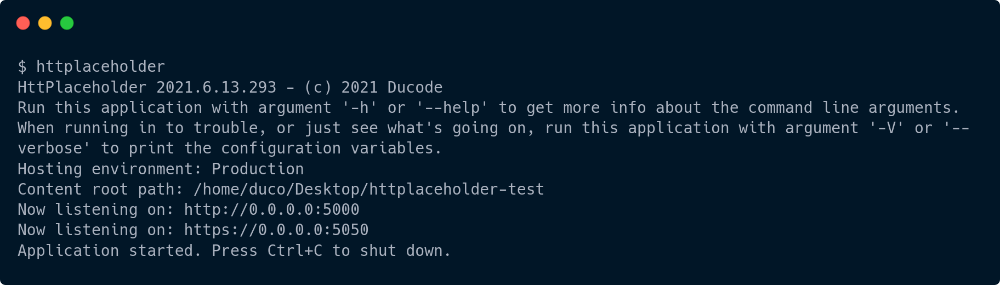

<h1 align="center">
  <a href="https://github.com/dukeofharen/httplaceholder">
    
  </a>
</h1>

<div align="center">
  HttPlaceholder<br />
  <em>Quickly stub away any HTTP service.</em>
  <br />
  <br />
  <a href="https://github.com/dukeofharen/httplaceholder/issues/new?assignees=&labels=bug&template=01_BUG_REPORT.md&title=bug%3A+">Report a Bug</a>
  ·
  <a href="https://github.com/dukeofharen/httplaceholder/issues/new?assignees=&labels=enhancement&template=02_FEATURE_REQUEST.md&title=feat%3A+">Request a Feature</a>
  · <a href="https://github.com/dukeofharen/httplaceholder/discussions">Ask a Question</a>
</div>

<div align="center">
<br />

[](LICENSE)

[](https://github.com/dukeofharen/httplaceholder/issues?q=is%3Aissue+is%3Aopen+label%3A%22help+wanted%22)
[](https://github.com/dukeofharen)
[](https://gitlab.com/ducode/httplaceholder/-/commits/master)

</div>

<details open="open">
<summary>Table of Contents</summary>

- [About](#about)
    - [Built With](#built-with)
- [Getting Started](#getting-started)
    - [Prerequisites](#prerequisites)
    - [Installation](#installation)
    - [Example](#example)
- [Getting started](#getting-started)
- [Documentation](#documentation)
    - [Tools](#tools)
- [Roadmap](#roadmap)
- [Support](#support)
- [Project assistance](#project-assistance)
- [Contributing](#contributing)
- [Authors & contributors](#authors--contributors)
- [Security](#security)
- [License](#license)

</details>

---

## About

HttPlaceholder lets you stub away any HTTP webservice.

It was thought up while I was working at a company which had many interconnected webservices. The development process
was very painful, because it meant all the other webservices should also be started on my local dev PC, or I had to use
the "development" environment, which did not work for half of the time. HttPlaceholder fills this gap nicely.

HttPlaceholder:

* can easily be installed on your dev PC.
* can be used to easily create stubs, either as separate YAML files, through the API or through the user interface.
* can easily be hosted on any server.
* can use many different HTTP condition checkers and response writers to make your HTTP stubs as specific as you need.

### Built With

- [.NET 6](https://dotnet.microsoft.com/apps/aspnet)
- [Vue.js](https://vuejs.org/)
- [Bootstrap](https://getbootstrap.com/)
- [CodeMirror](https://codemirror.net/)
- [ImageSharp](https://sixlabors.com/products/imagesharp/)

## Getting Started

### Prerequisites

Linux, Windows and Mac are supported.

### Installation

Follow these steps to install / update HttPlaceholder. If you update HttPlaceholder, make sure to read the [changelog](CHANGELOG) to see if there are no breaking changes.

**Install on Windows**

```powershell
Set-ExecutionPolicy Bypass -Scope Process -Force; iex ((New-Object System.Net.WebClient).DownloadString('https://raw.githubusercontent.com/dukeofharen/httplaceholder/master/scripts/Install-Windows.ps1'))
```

**Install on Linux**

```bash
sudo curl -o- https://raw.githubusercontent.com/dukeofharen/httplaceholder/master/scripts/install-linux.sh | sudo bash
```

**Install on Mac**

```bash
sudo curl -o- https://raw.githubusercontent.com/dukeofharen/httplaceholder/master/scripts/install-mac.sh | sudo bash
```

**Install as .NET tool**

```bash
dotnet tool install --global httplaceholder
```

### Example

- Install HttPlaceholder (see [Installation](#installation)).
- Create a new .yaml file (e.g. `stub.yaml`).
- Copy and paste these contents in your new file:

```yml
- id: situation-01
  conditions:
    method: GET
    url:
      path: /users
      query:
        id: 12
        filter: first_name
  response:
    statusCode: 200
    text: |
      {
        "first_name": "John"
      }
    headers:
      Content-Type: application/json
```

- Open the terminal in the folder you've added the `stub.yaml` file and run the following command: `httplaceholder`.
  HttPlaceholder will now start and will load the stubs in the current folder.
  
  
- Perform a specific HTTP call to HttPlaceholder so your provided response will be returned.
  - For Linux / Mac (cURL needs to be installed):
  ```bash
  curl "http://localhost:5000/users?id=12&filter=first_name" -D-
  ```
  - For Windows (uses Powershell):
  ```powershell
  (Invoke-WebRequest "http://localhost:5000/users?id=12&filter=first_name").RawContent
  ```
  
- You can view and inspect the performed requests in the user interface at <http://localhost:5000/ph-ui>.

  
For more sophisticated examples, go to the [samples](docs/docs.md#samples) to view samples for all supported HTTP condition checkers and response writers.

## Documentation

- [Installation](docs/docs.md#installation)
  - [Windows](docs/docs.md#windows)
  - [Linux](docs/docs.md#linux)
  - [Mac](docs/docs.md#mac)
  - [Docker](docs/docs.md#docker)
- [Getting started](docs/docs.md#getting-started)
- [Stub samples](docs/docs.md#samples)
- [REST API](docs/docs.md#rest-api)
- [Configuration](docs/docs.md#configuration)
- [Request conditions](docs/docs.md#request-conditions)
- [Response writers](docs/docs.md#response-writers)
- [Management interface](docs/docs.md#management-interface)

### Tools
* [HttPlaceholder REST API client for .NET](docs/docs.md#httplaceholder-rest-api-client-for-net)

## Roadmap

See the [open issues](https://github.com/dukeofharen/httplaceholder/issues) for a list of proposed features (and known
issues).

- [Top Feature Requests](https://github.com/dukeofharen/httplaceholder/issues?q=label%3Aenhancement+is%3Aopen+sort%3Areactions-%2B1-desc) (Add your votes using the 👍 reaction)
- [Top Bugs](https://github.com/dukeofharen/httplaceholder/issues?q=is%3Aissue+is%3Aopen+label%3Abug+sort%3Areactions-%2B1-desc) (Add your votes using the 👍 reaction)
- [Newest Bugs](https://github.com/dukeofharen/httplaceholder/issues?q=is%3Aopen+is%3Aissue+label%3Abug)

## Support

Reach out to the maintainer at one of the following places:

- [GitHub discussions](https://github.com/dukeofharen/httplaceholder/discussions)
- The email which is located [in GitHub profile](https://github.com/dukeofharen)

## Project assistance

If you want to say **thank you** or/and support active development of HttPlaceholder:

- Add a [GitHub Star](https://github.com/dukeofharen/httplaceholder) to the project.
- Tweet about HttPlaceholder on your Twitter.
- Send me an email (see my [GitHub Profile](https://github.com/dukeofharen)).

## Contributing

First off, thanks for taking the time to contribute! Contributions are what make the open-source community such an
amazing place to learn, inspire, and create. Any contributions you make will benefit everybody else and are **greatly
appreciated**.

We have set up a separate document containing our [contribution guidelines](docs/CONTRIBUTING.md).

Thank you for being involved!

## Authors & contributors

The original setup of this repository is by [dukeofharen](https://github.com/dukeofharen).

For a full list of all authors and contributors,
check [the contributor's page](https://github.com/dukeofharen/httplaceholder/contributors).

## Security

HttPlaceholder follows good practices of security, but 100% security can't be granted in software. HttPlaceholder is
provided **"as is"** without any **warranty**. Use at your own risk.

_For more info, please refer to the [security](docs/SECURITY.md)._

## License

This project is licensed under the **MIT license**.

See [LICENSE](LICENSE) for more information.
