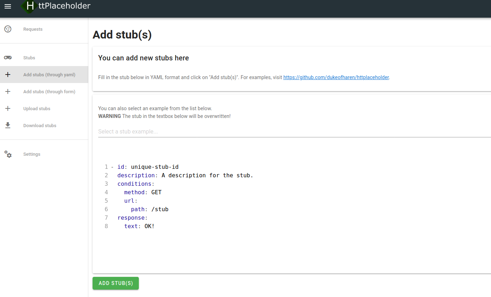
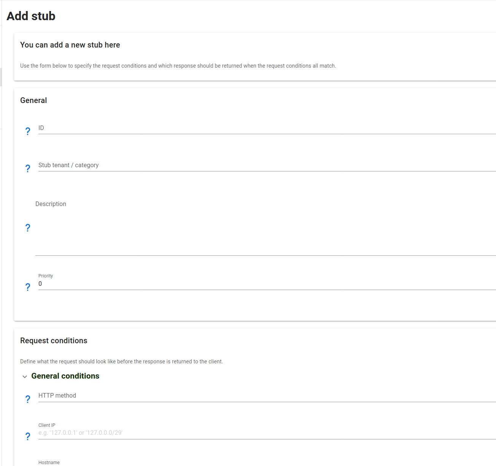
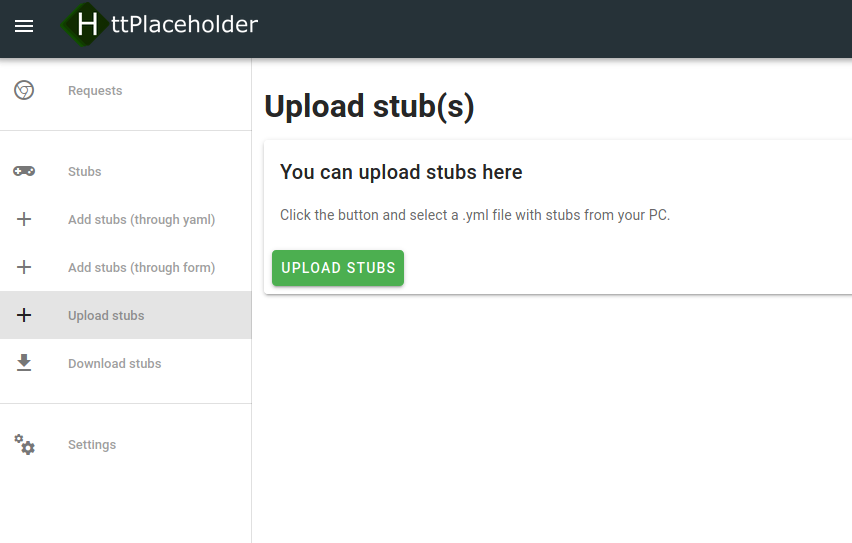

# Management interface

Besides being an HTTP stub and having a REST API to configure the stubs, HttPlaceholder also has a user interface to manage HttPlaceholder. This user interface talks to the [REST API](API.md).

## How to get there

When you run the stub, you can just go to `http://placeholder/ph-ui`. If you've secured the API with [basic authentication](CONFIG.md), you need to log in first.

## Requests

On the requests page you can see all requests made to HttPlaceholder. It will show which URL was called and if a valid stub was found for the requests. You can also open a specific request and view the details of this request.

You can also delete all requests here and filter all requests by a search term or tenant (category). 

## Stubs

On the stubs page you can see all stubs configured in HttPlaceholder. When you click on a stub, you'll see the stub configuration in YAML.

## Add stub(s)

You can add stubs in one of three ways: either by filling in the stub YAML, by filling in a form or by uploading a YAML file from your PC.

### Adding stubs as YAML

Click on the "Add stubs (through yaml)" button in the sidebar.

You can add a single stub here or you can provide multiple stubs in YAML format. You can also pick an example so you can work from that.

### Adding stub through form

Click on the "Add stubs (through form)" button in the sidebar.

You can fill in nearly all request conditions and response writers available in YAML on this form.

### Uploading stubs

Click on the "Upload stubs" button in the sidebar.

You can select one or multiple .yaml files from your PC. The stubs will then be added to HttPlaceholder.