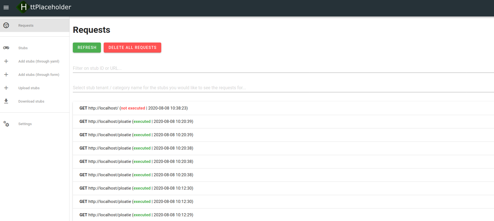
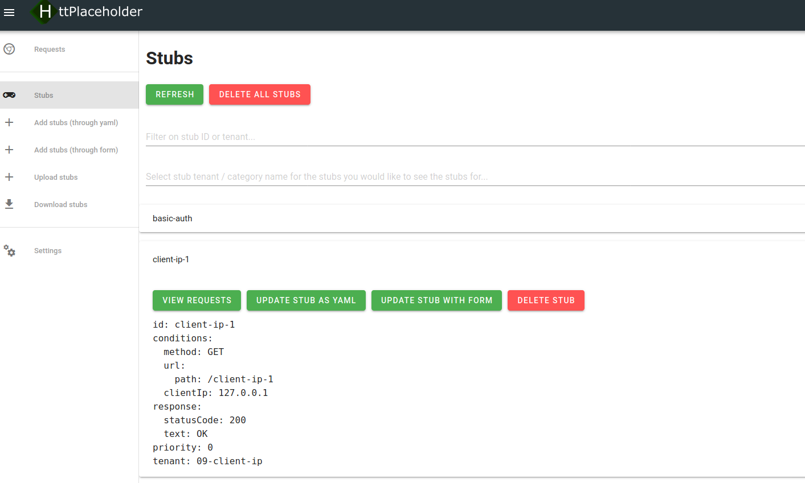

# Management interface

Besides being an HTTP stub and having a REST API to configure the stubs, HttPlaceholder also has a user interface to manage HttPlaceholder. This user interface talks to the [API.md](REST API).

## How to get there

When you run the stub, you can just go to `http://placeholder/ph-ui`. If you've secured the API with [basic authentication](CONFIG.md), you need to log in first.

## Requests

On the requests page you can see all requests made to HttPlaceholder. It will show which URL was called and if a valid stub was found for the requests. You can also open a specific request and view the details of this request.

The top bar has some options:

- You can fill in the stub ID or the URL to filter the requests. The eraser empties the search bar.
- The blue button removes **ALL** requests.
- The green button refreshes the requests.

## Stubs

On the stubs page you can see all stubs configured in HttPlaceholder. When you click on a stub, you'll see the stub configuration in YAML.

The top bar has some options:

- You can fill in the stub ID to filter the stubs. The eraser empties the search bar.
- The green button refreshes the requests.