# HttPlaceholder documentation

- **[Installation](#installation)**
  - [Dotnet global tool](#dotnet-global-tool-cross-platform)
  - [Windows](#windows)
  - [Linux](#linux)
  - [Mac](#mac)
  - [Docker](#docker)
  - [Hosting](#hosting)
- **[Getting started](#getting-started)**
- **[Stub anatomy](#stub-anatomy)**
- **[Request conditions](#request-conditions)**
  - [General](#general-stub-info)
  - [Description](#description)
  - [Enabled](#enabled)
  - [Priority](#priority)
  - [URI](#uri)
    - [Path](#path)
    - [Full path](#full-path)
    - [Query string](#query-string)
    - [Is HTTPS](#is-https)
  - [HTTP method](#http-method)
  - [HTTP headers](#request-headers)
  - [Request body](#request-body)
    - [Raw body](#raw-body)
    - [Form](#form)
    - [JSON](#json)
    - [JSONPath](#jsonpath)
    - [XPath](#xpath)
  - [Client IP validation](#client-ip-validation)
  - [Hostname](#hostname)
  - [Security](#security)
    - [Basic authentication](#basic-authentication)
  - [String checking keywords](#string-checking-keywords)
  - [Scenario](#request-scenario)
    - [Hit counter checking](#hit-counter-checking)
    - [State checking](#state-checking)
- **[Response writers](#response-writers)**
  - [Status code](#status-code)
  - [Response headers](#response-headers)
  - [Response body](#response-body)
    - [Text](#text-response)
    - [JSON](#json-response)
    - [XML](#xml-response)
    - [HTML](#html-response)
    - [Base64](#base64-response)
  - [Content type](#content-type)
  - [String / regex replace](#string--regex-replace)
  - [Files](#files)
    - [Image](#image)
    - [File](#file)
  - [Extra duration](#extra-duration)
  - [Permanent and temporary redirects](#permanent-and-temporary-redirects)
  - [Line endings](#update-line-endings)
  - [Scenario](#scenario)
    - [Set scenario state](#set-scenario-state)
    - [Clear state](#clear-state)
  - [Dynamic mode](#dynamic-mode)
    - [Query string](#query-string-parser)
    - [UUID](#uuid)
    - [Request headers](#request-headers-parser)
    - [Posted form values](#form-post)
    - [Request body](#request-body-parser)
    - [Display URL](#display-url)
    - [Root URL](#root-url)
    - [Client IP](#client-ip)
    - [Local and UTC date & time](#local-and-utc-date--time)
    - [JSONPath](#jsonpath-parser)
    - [Scenario state / hit count](#scenario-state--hit-count)
    - [Fake data](#fake-data)
  - [Reverse proxy](#reverse-proxy)
  - [Abort connection](#abort-connection)
- **[REST API](#rest-api)**
- **[Configuration](#configuration)**
  - [Configuration properties](#configuration-properties)
  - [Web](#web)
  - [Authentication](#authentication)
  - [Storage](#storage)
  - [GUI](#gui)
  - [Stub](#stub)
  - [Config JSON file](#config-json-file)
- **[Samples](#samples)**
- **[Management interface](#management-interface)**
  - [How to get there](#how-to-get-there)
  - [Requests page](#requests-page)
  - [Stubs page](#stubs-page)
  - [Import stubs](#import-stubs)
    - [Upload stubs](#upload-stubs)
    - [Import cURL commands](#import-curl-commands)
    - [Import HTTP archive (HAR)](#import-http-archive-har)
    - [Import OpenAPI definition](#import-openapi-definition)
  - [Add stub(s) form](#add-stubs-form)
  - [Scenarios](#scenarios-page)
  - [Settings page](#settings-page)
- **[Tools and client libraries](#tools-and-client-libraries)**
  - [HttPlaceholder REST API client for .NET](#httplaceholder-rest-api-client-for-net)

# Installation

Follow these steps to install / update HttPlaceholder. If you update HttPlaceholder, make sure to read the [changelog](../CHANGELOG) to see if there are no breaking changes.

## Dotnet global tool (cross platform)

Make sure you have installed the correct .NET SDK (at least .NET 7) for your OS (see https://dotnet.microsoft.com/download). When the .NET SDK is installed, run the following command to install HttPlaceholder:

```shell
dotnet tool install --global HttPlaceholder
```

## Windows

The only thing needed to use HttPlaceholder on your local development machine, is extracting the archive with the HttPlaceholder binaries (which can be found [here](https://github.com/dukeofharen/httplaceholder/releases/latest)).

For installing HttPlaceholder through your PowerShell terminal, execute the following command:

```powershell
Set-ExecutionPolicy Bypass -Scope Process -Force; iex ((New-Object System.Net.WebClient).DownloadString('https://raw.githubusercontent.com/dukeofharen/httplaceholder/master/scripts/Install-Windows.ps1'))
```

This is a self contained version of HttPlaceholder: no SDK has to be installed to run it.

## Linux

The only thing needed to use HttPlaceholder on your local development machine, is extracting the archive with the HttPlaceholder binaries (which can be found [here](https://github.com/dukeofharen/httplaceholder/releases/latest)). You need to put HttPlaceholder on your path variable yourself.

Alternatively, to install HttPlaceholder on Linux, run the following command in your terminal (make sure you're running as administrator):

```bash
curl -o- https://raw.githubusercontent.com/dukeofharen/httplaceholder/master/scripts/install-linux.sh | bash
```

This is a self contained version of HttPlaceholder: no SDK has to be installed to run it.

If you would like to expose HttPlaceholder to the outside world, I would recommend to use Nginx or Apache as reverse proxy. To keep the service running even if you're not logged in through an SSH session, you can use something like systemd.

There are two Vagrant boxes (Windows and Ubuntu) that you can use to view how installation of HttPlaceholder is done. You can find them in this repository under the folder "vagrant". You need to have [Vagrant](https://www.vagrantup.com/) installed. Also, make sure you either have built HttPlaceholder (run `build.sh` in the root of this repository) or downloaded the files `httplaceholder_linux-x64.tar.gz` and `httplaceholder_win-x64.zip` (see https://github.com/dukeofharen/httplaceholder/releases/latest) and put them in a new folder `dist` in the root of the repository. After that, it's just a matter of going to the correct folder in your terminal and typing `vagrant up`. HttPlaceholder will then be installed under Windows or Ubuntu and can be reached by going to `http://localhost:8080` or `https://localhost:4430`.

## Mac

The only thing needed to use HttPlaceholder on your local development machine, is extracting the archive with the HttPlaceholder binaries (which can be found [here](https://github.com/dukeofharen/httplaceholder/releases/latest)). You need to put HttPlaceholder on your path variable yourself.

To install HttPlaceholder on Mac OS X, run the following command in your terminal (make sure you're running as administrator):

```bash
curl -o- https://raw.githubusercontent.com/dukeofharen/httplaceholder/master/scripts/install-mac.sh | bash
```

This is a self contained version of HttPlaceholder: no SDK has to be installed to run it.

## Docker

HttPlaceholder has a Docker image; it can be found [here](https://hub.docker.com/r/dukeofharen/httplaceholder). This page explains some basics about the Docker image and some examples you can use.

### Basic example

This is a very basic example for running HttPlaceholder locally from the command line.

```shell
docker run -p 5000:5000 dukeofharen/httplaceholder:latest
```

HttPlaceholder can now be reached on `http://localhost:5000` (or `http://localhost:5000/ph-ui` to get to the management interface).

### Docker configuration

The Docker container uses the configuration values as specified [here](#configuration). Here is an example of starting the HttPlaceholder container with different ports for HTTP and HTTPS:

```shell
docker run -p 8080:8080 -p 4430:4430 --env port=8080 --env httpsPort=4430 dukeofharen/httplaceholder:latest
```
By default, HttPlaceholder in Docker is configured to read [YAML stub files](#input-file-optional) from path `/var/httplaceholder`. Also, by default, stubs that are made through the UI / API and requests are saved in the home directory under `/root/.httplaceholder`. Mounting these folders as Docker volumes allows you to save the stub data on your host machine.

### Docker Compose examples

[Here](https://github.com/dukeofharen/httplaceholder/tree/master/docker) you can find a few Docker Compose examples how you can run HttPlaceholder using Docker.

## Hosting

### Running behind reverse proxy

IIS, Nginx and Apache (and a lot of other web servers) have the option to run an application behind a reverse proxy. For HttPlaceholder to function correctly behind a reverse proxy, the server has to send a few "proxy" headers to HttPlaceholders. The following headers should be sent:

- `X-Forwarded-For`: contains all IP addresses of the calling client and all proxy servers in between the client and HttPlaceholder. Used to determine the IP of the calling client.
- `X-Forwarded-Proto`: contains the protocol of the original call to the proxying web server (`http` or `https`).
- `X-Forwarded-Host`: contains the hostname of the original call to the proxying web server(e.g. `httplaceholder.org`).

These headers are, right now, only used instead of the "real" values if the actual IP address of the proxy server is the loopback IP (e.g. `127.0.0.1`, `::1` etc.).

Read more about this subject for the specific web servers:

- [Nginx](https://www.nginx.com/resources/wiki/start/topics/examples/forwarded/)
- [Apache](https://httpd.apache.org/docs/2.4/mod/mod_proxy.html)
- [IIS](https://techcommunity.microsoft.com/t5/iis-support-blog/setup-iis-with-url-rewrite-as-a-reverse-proxy-for-real-world/ba-p/846222)

### Using SSL

HttPlaceholder supports HTTPS. See [configuration](#configuration) for more information on this. By default, it uses the private key that is installed with HttPlaceholder. This file is named `key.pfx` and the password is `1234`. Before using HttPlaceholder and calling the HTTPS URL, you'll need to make sure to import and trust the .pfx file on your OS. For your convenience, three scripts (for Windows, Linux and Mac) are added for installing and trusting the .pfx file of HttPlaceholder. You can find the script in the installation folder: `install-private-key.sh` for Mac and Linux and `Install-Private-Key.ps1` for Windows.

### Microsoft IIS

It is also possible to host HttPlaceholder under IIS. You can just install HttPlaceholder using the installer mentioned above. You need to install the .NET Hosting Bundle in order for you to host .NET applications under IIS. You can find the installer at <https://dotnet.microsoft.com/download/dotnet-core/current/runtime>, and download the Hosting Bundle.

You need, of course, to download HttPlaceholder to your Windows machine. Just follow the instructions above. Besides that, make sure IIS is installed.

If you've completed the steps above, execute the following steps:

- Create a new site in IIS and (optionally) fill in a hostname and the location to the HttPlaceholder binaries.

  

- Now, you need to setup the configuration. For this, you need to rename the file `_web.config` in the HttPlaceholder installation folder to `web.config`. You can modify the `web.config` to look like this.

```xml
<?xml version="1.0" encoding="utf-8"?>
<configuration>
  <location path="." inheritInChildApplications="false">
    <system.webServer>
      <handlers>
        <add name="aspNetCore" path="*" verb="*" modules="AspNetCoreModuleV2" resourceType="Unspecified" />
      </handlers>
      <aspNetCore
           processPath=".\HttPlaceholder.exe"
           arguments="-V --sqliteConnectionString Data Source=C:\\httplaceholderdata\\httplaceholder.db "
           stdoutLogEnabled="true"
           stdoutLogFile="C:\logs\httplaceholder"
           hostingModel="inprocess" />
    </system.webServer>
  </location>
</configuration>
```

In the example above, all the standard output logging will be written to a file and HttPlaceholder is configured to store its data in a SQLite database (all the configuration values are explained [here](#configuration)). While this seems like a nice solution, if you have multiple configuration items, it might be better if you create a separate `config.json` file and point to that file in your `web.config`. You then might have these two files:

*config.json*
```json
{
    "sqliteConnectionString": "Data Source=C:\httplaceholderdata\httplaceholder.db"
}
``` 

*web.config*
```xml
<?xml version="1.0" encoding="utf-8"?>
<configuration>
  <location path="." inheritInChildApplications="false">
    <system.webServer>
      <handlers>
        <add name="aspNetCore" path="*" verb="*" modules="AspNetCoreModuleV2" resourceType="Unspecified" />
      </handlers>
      <aspNetCore
           processPath=".\HttPlaceholder.exe"
           arguments="-V --configjsonlocation C:\\httplaceholderdata\\config.json"
           stdoutLogEnabled="true"
           stdoutLogFile="C:\logs\httplaceholder"
           hostingModel="inprocess" />
    </system.webServer>
  </location>
</configuration>
```

In this case, all the configuration is kept in a separate JSON file which is referred to in the `web.config`.

If you go to the hostname + port as specified in the IIS site and everything went well, you will go to HttPlaceholder (open the `/ph-ui` path to verify it works).

There are two Vagrant boxes (Windows and Ubuntu) that you can use to view how installation of HttPlaceholder is done. You can find them in this repository under the folder "vagrant". You need to have [Vagrant](https://www.vagrantup.com/) installed. Also, make sure you either have built HttPlaceholder (run `build.sh` in the root of this repository) or downloaded the files `httplaceholder_linux-x64.tar.gz` and `httplaceholder_win-x64.zip` (see https://github.com/dukeofharen/httplaceholder/releases/latest) and put them in a new folder `dist` in the root of the repository. After that, it's just a matter of going to the correct folder in your terminal and typing `vagrant up`. HttPlaceholder will then be installed under Windows or Ubuntu and can be reached by going to `http://localhost:8080` or `https://localhost:4430`.

#### Troubleshooting

- If you get an error something like `An unhandled exception was thrown by the application. code = ReadOnly (8), message = System.Data.SQLite.SQLiteException (0x800017FF): attempt to write a readonly database`, it means your SQLite database is not writable. Make sure the IIS user can write to this file.

### Windows Service

Hosting the application as a Windows Service (and subsequently using a reverse proxy in IIS to host the application) is officially not supported (maybe in the future). You can, however, use tools like [NSSM](http://nssm.cc/) (Non-Sucking Service Manager, brilliant name by the way) to host a console application as a Windows service. For configuration, you can either use the `config.json` file or the command line arguments.

# Getting started

- Install HttPlaceholder (see [Installation](#installation)).
- Create a new .yaml file (e.g. `stub.yaml`).
- Copy and paste these contents in your new file:

```yml
- id: situation-01
  conditions:
    method: GET
    url:
      path:
        equals: /users
      query:
        id:
          equals: 12
        filter:
          equals: first_name
  response:
    statusCode: 200
    text: |
      {
        "first_name": "John"
      }
    headers:
      Content-Type: application/json
```

- Open the terminal in the folder you've added the `stub.yaml` file and run the following command: `httplaceholder`.
  HttPlaceholder will now start and will load the stubs in the current folder.
  

- Perform a specific HTTP call to HttPlaceholder so your provided response will be returned.
  - For Linux / Mac (cURL needs to be installed):
  ```bash
  curl "http://localhost:5000/users?id=12&filter=first_name" -D-
  ```
  - For Windows (uses Powershell):
  ```powershell
  (Invoke-WebRequest "http://localhost:5000/users?id=12&filter=first_name").RawContent
  ```

- You can view and inspect the performed requests in the user interface at <http://localhost:5000/ph-ui>.
  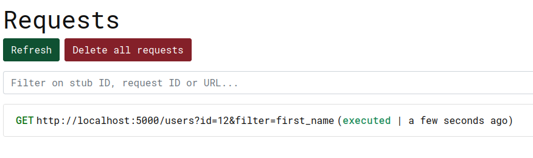

For more sophisticated examples, go to the paragraph [samples](#samples) to view samples for all supported HTTP condition checkers and response writers.

# Stub anatomy

A stub is simply a piece of YAML that contains instructions for HttPlaceholder for how the request should look like and what the response should look like when a request was matched against this stub. Besides this, some extra metadata can be provided to the stub. For reference, take a look at the example below.

```yml
- id: situation-03
  tenant: users-api
  scenario: users-api-scenario
  priority: 1
  description: Description of the stub.
  enabled: true
  conditions:
    method: GET
    url:
      path:
        equals: /users
      query:
        id:
          equals: 15
        filter:
          equals: last_name
  response:
    statusCode: 200
    json: |
      {
        "last_name": "Jackson"
      }
```

- `id`: the unique ID of the stub. This should ALWAYS be filled in.
- `conditions`: all the conditions a request should match before the stub is picked. Read more about it [here](#request-conditions).
- `response`: the response that should be returned if the request matches according to the conditions. Read more about it [here](#response-writers).
- `tenant`: a way to group several stubs together. Read more about it [here](#tenants).
- `scenario`: a way to put a stub under a scenario. If the stub is part of a scenario, it will be possible for the stub to check for the scenario hit count or the scenario state. It is also possible to set the scenario state or clear the scenario state. Multiple stubs can be part of the same scenario. To read more about it, go [here](#scenarios) or [here](#request-scenario).
- `priority`: a way to give a priority to a stub. If multiple stubs are found for a request, the stub with the highest priority will take precedence. Read more about it [here](#priority).
- `description`: just a simple way for you to specify what the stub is for.
- `enabled`: simple way of specifying if a stub is enabled or disabled. Read more about it [here](#enabled).

# Request conditions

Whenever HttPlaceholder receives a request, all the conditions of all stubs are checked to see which stub corresponds to the sent request. There are condition checkers for example the URL, posted data etc. This paragraph explains more.

## General stub info

Under the "conditions" element, you describe how the request should look like. If the incoming request matches the conditions, the [response](#response-writers) will be returned.

```yml
- id: situation-03
  tenant: users-api
  conditions:
    method: GET
    url:
      path:
        equals: /users
      query:
        id:
          equals: 15
        filter:
          equals: last_name
  response:
    statusCode: 200
    text: |
      {
        "last_name": "Jackson"
      }
    headers:
      Content-Type: application/json
```

This means that when:

- The URL path equals "/users"
- A query string with name "id" and value "15" is sent.
- A query string with name "filter" and value "last_name" is sent.

If all these conditions match, the response as defined under the "response" element is returned. For more information about the response element, you can read more [here](#response-writers).

The stub also has a "tenant" field defined. This is a free text field which is optional. This field makes it possible to do operations of multiple stubs at once (e.g. delete all stubs with a specific tenant, get all stubs of a specific tenant or update all stubs of a specific tenant). To learn more about tenants, go to [REST API](#rest-api).

## Description

A free text field where you can specify where the stub is for. It is optional.

```yml
- id: situation-01
  description: Returns something
  conditions:
    method: GET
    url:
      path:
        equals: /users
  response:
    statusCode: 200
    text: OK
```

## Enabled

Describes whether the stub is enabled or not. If no `enabled` field is provided, the stub is enabled by default. Value can be `true` or `false`.

```yml
- id: is-disabled
  enabled: false
  conditions:
    method: GET
    url:
      path:
        equals: /users
  response:
    text: This stub is disabled.
```

## Priority

There are cases when a request matches multiple stub. If this is the case, you can use the "priority" element. With the priority element, you can specify which stub should be used if multiple stubs are found. The stub with the highest priority will be used. If you don't set the priority on the stub, it will be 0 by default.

```yml
- id: fallback
  priority: -1
  conditions: 
    method: GET
  response:
    statusCode: 200
    text: OK-Fallback

- id: situation-01
  conditions:
    method: GET
    url:
      path:
        equals: /users
  response:
    statusCode: 200
    text: OK
```

In the scenario above, if you got to url `http://httplaceholder/users`, both stubs will be matched. Because the priority of the fallback stub is -1, the other stub will be used instead.

## URI

### Path

The path condition is used to check a part of the URL path (so the part after http://... and before the query string). The condition can be filled with both a string (which is always a regular expression) or an object containing keywords. In the examples below, keyword `equals` is used, but many more options are available for use. Click [here](#string-checking-keywords) for more information about the keywords.

```yml
- id: situation-01
  conditions:
    method: GET
    url:
      path:
        equals: /users
  response:
    statusCode: 200
    text: OK
```

### Full path

This condition checker looks a lot like the path checker, but this checker also checks extra URL parameters, like the query string. The condition can be filled with both a string (which is always a regular expression) or an object containing keywords. In the examples below, keyword `equals` is used, but many more options are available for use. Click [here](#string-checking-keywords) for more information about the keywords.

```yml
- id: situation-01
  conditions:
    method: GET
    url:
      fullPath:
        equals: /users?filter=first_name
  response:
    statusCode: 200
    text: OK
```

**Correct request**

- Method: GET
- URL: http://localhost:5000/users?filter=first_name

### Query string

This condition checker can check the query string in a name-value collection like way. The condition can be filled with both a string (which is always a regular expression) or an object containing keywords. In the examples below, keyword `equals` is used, but many more options are available for use. Click [here](#string-checking-keywords) for more information about the keywords.

```yml
- id: situation-01
  conditions:
    method: GET
    url:
      query:
        id:
          equals: 14
        filter:
          equals: last_name
  response:
    statusCode: 200
    text: OK
```

**Correct request**

- Method: GET
- URL: http://localhost:5000/anyPath?id=14&filter=last_name

Besides this, the request condition checker can also be used to check if a query string should be present or not, without checking the value. Let's take a look at the following example:

```yml
- id: situation-01
  conditions:
    method: GET
    url:
      query:
        id:
          present: true
        filter:
          present: false
  response:
    statusCode: 200
    text: OK
```

In this case, the `id` parameter should be sent, but the `filter` parameter should not.

### Is HTTPS

This condition checker can be used to verify if a request uses HTTPS or not. To configure HttPlaceholder with HTTPS, read [configuration](#configuration).

```yml
- id: ishttps-ok
  conditions:
    method: GET
    url:
      path:
        equals: /ishttps-ok
      isHttps: true
  response:
    statusCode: 200
    text: OK
```

**Correct request**

- Method: GET
- URL: https://localhost:5050/anyPath

## HTTP method

This condition checker can check the HTTP method (e.g. GET, POST, PUT, DELETE etc.).

```yml
- id: situation-01
  conditions:
    method: GET
  response:
    statusCode: 200
    text: OK
```

It is also possible to specify multiple HTTP methods. A request with any of these HTTP requests will then succeed.

```yml
- id: situation-01
  conditions:
    method:
      - GET
      - POST
  response:
    statusCode: 200
    text: OK
```

**Correct request**

- Method: GET
- URL: http://localhost:5000/anyPath

## Request headers

This condition checker can check whether the sent headers match with the headers in the stub. The condition can be filled with both a string (which is always a regular expression) or an object containing keywords. In the examples below, keyword `equals` is used, but many more options are available for use. Click [here](#string-checking-keywords) for more information about the keywords.

```yml
- id: header-check
  conditions:
    method: GET
    headers:
      X-Api-Key:
        equals: secret123
  response:
    statusCode: 200
    text: OK
```

**Correct request**

- Method: GET
- URL: http://localhost:5000/anyPath
- Headers:
  - X-Api-Key: secret123

Besides this, the request condition checker can also be used to check if a header should be present or not, without checking the value. Let's take a look at the following example:

```yml
- id: header-check
  conditions:
    method: GET
    headers:
      X-Api-Key:
        present: true
      X-Header-2:
        present: false
  response:
    statusCode: 200
    text: OK
```

In this case, the `X-Api-Key` header should be sent but the `X-Header-2` header should not.

## Request body

### Raw body

This condition checker can check whether the posted body corresponds to the given rules in the stub. It is possible to add multiple conditions. The condition can be filled with both a string (which is always a regular expression) or an object containing keywords. In the examples below, keyword `contains` is used, but many more options are available for use. Click [here](#string-checking-keywords) for more information about the keywords.

```yml
- id: situation-01
  conditions:
    method: POST
    url:
      path:
        equals: /users
    body:
      - contains: username
      - contains: john
  response:
    statusCode: 200
    text: '{"result": true}'
    headers:
      Content-Type: application/json
```

**Correct request**

- Method: POST
- URL: http://localhost:5000/users
- Headers:
  - Content-Type: application/x-www-form-urlencoded
- Body:
```json
{"username": "john"}
```

### Form

The form value condition checker can check whether the posted form values correspond to the given rules in the stub. It is possible to add multiple conditions. The condition can be filled with both a string (which is always a regular expression) or an object containing keywords. In the examples below, keyword `equals` is used, but many more options are available for use. Click [here](#string-checking-keywords) for more information about the keywords.

```yml
- id: form-ok
  conditions:
    method: POST
    url:
      path:
        equals: /form
    form:
      - key: key1
        value:
          equals: sjaak
      - key: key2
        value:
          equals: bob
      - key: key2
        value:
          equals: ducoo
  response:
    text: OK
```

**Correct request**

- Method: POST
- URL: http://localhost:5000/form
- Body:
```
key1=sjaak&key2=bob&key2=ducoo
```

Besides this, the request condition checker can also be used to check if a form value should be present or not, without checking the value. Let's take a look at the following example:

```yml
- id: form-ok
  conditions:
    method: POST
    url:
      path:
        equals: /form
    form:
      - key: key1
        value:
          present: true
      - key: key2
        value:
          present: false
  response:
    text: OK
```

In this case, the `key1` value should be sent but the `key2` value not.

### JSON

The JSON condition checker can be used to check if the posted JSON is posted according to your specified conditions. You can specify both an array or an object as input for the condition. When checking for string values in a JSON property, HttPlaceholder will use regular expressions to check if the condition is OK.

**Correct request (JSON object)**

```yml
- id: json-object
  conditions:
    method: POST
    json:
      username: ^username$
      subObject:
        strValue: stringInput
        boolValue: true
        doubleValue: 1.23
        dateTimeValue: 2021-04-16T21:23:03
        intValue: 3
        nullValue: null
        arrayValue:
          - val1
          - subKey1: subValue1
            subKey2: subValue2
  response:
    text: OK JSON OBJECT!
```

- Method: POST
- URL: http://localhost:5000
- Body:
```json
{
  "username": "username",
  "subObject": {
    "strValue": "stringInput",
    "boolValue": true,
    "doubleValue": 1.23,
    "dateTimeValue": "2021-04-16T21:23:03",
    "intValue": 3,
    "nullValue": null,
    "arrayValue": [
      "val1",
      {
        "subKey1": "subValue1",
        "subKey2": "subValue2"
      }
    ]
  }
}
```

**Correct request (JSON array)**

```yml
- id: json-array
  conditions:
    method: POST
    json:
      - val1
      - 3
      - 1.46
      - 2021-04-17T13:16:54
      - stringVal: val1
        intVal: 55
  response:
    text: OK JSON ARRAY!
```

- Method: POST
- URL: http://localhost:5000
- Body:
```json
[
    "val1",
    3,
    1.46,
    "2021-04-17T13:16:54",
    {
        "stringVal": "val1",
        "intVal": 55
    }
]
```

### JSONPath

Using the JSONPath condition checker, you can check the posted JSON body to see if it contains the correct elements. It is possible to add multiple conditions.

**Using a string array**

```yml
- id: jpath-test
  conditions:
    method: PUT
    url:
      path:
        equals: /users
    jsonPath:
      - "$.phoneNumbers[?(@.type=='iPhone')]"
  response:
    statusCode: 204
```

**Specifying the expected value separately**

The `expectedValue` variable of this condition can be used with regular expressions if needed.

```yml
- id: jpath-test
  conditions:
    method: PUT
    url:
      path:
        equals: /users
    jsonPath:
      - query: $.phoneNumbers[0].type
        expectedValue: iPhone
  response:
    statusCode: 204
```

**Specifying the expected value separately and a single JSONPath string**

Both JSONPath condition types can be combined.

```yml
- id: jpath-test
  conditions:
    method: PUT
    url:
      path:
        equals: /users
    jsonPath:
      - $.name
      - query: $.phoneNumbers[0].type
        expectedValue: iPhone
  response:
    statusCode: 204
```

**Correct request**

- Method: PUT
- URL: http://localhost:5000/users
- Body:
```json
{
    "name": "John",
	"phoneNumbers": [{
		"type": "iPhone",
		"number": "0123-4567-8888"
	}, {
		"type": "home",
		"number": "0123-4567-8910"
	}]
}
```

### XPath

Using the XPath condition checker, you can check the posted XML body to see if it contains the correct elements. It is possible to add multiple conditions.

It is also possible to (pre)-set the XML namespaces of a posted XML body. If no namespaces are set in the stub, HttPlaceholder will try to fetch the namespaces itself using a regular expression.

```yml
- id: regular-xml
  conditions:
    method: POST
    url:
      path:
        equals: /xpath-test
    headers:
      Content-Type:
        contains: application/soap+xml
    xpath:
      - queryString: /object/a[text() = 'TEST']
  response:
    statusCode: 200
    text: <result>OK</result>
    headers:
      Content-Type: text/xml
```

```yml
- id: regular-xml
  conditions:
    method: POST
    url:
      path:
        equals: /xpath-test
    headers:
      Content-Type:
        contains: application/soap+xml
    xpath:
      - queryString: /object/a[text() = 'TEST']
        namespaces:
          soap: http://www.w3.org/2003/05/soap-envelope
          m: http://www.example.org/stock/Reddy
  response:
    statusCode: 200
    text: <result>OK</result>
    headers:
      Content-Type: text/xml
```

**Correct request**

- Method: POST
- URL: http://localhost:5000/xpath-test
- Headers:
  - Content-Type: application/soap+xml; charset=utf-8
- Body:
```xml
<?xml version="1.0"?><object><a>TEST</a><b>TEST2</b></object>
```

## Client IP validation

It is also possible to set a condition to check the the client IP. A condition can be set for a single IP address or a whole IP range.

```yml
# Client IP address validation on a single IP address
- id: client-ip-1
  conditions:
    method: GET
    url:
      path:
        equals: /client-ip-1
    clientIp: 127.0.0.1
  response:
    statusCode: 200
    text: OK
```

```yml
# Client IP address validation on an IP range
- id: client-ip-2
  conditions:
    method: GET
    url:
      path:
        equals: /client-ip-2
    clientIp: '127.0.0.0/29'
  response:
    statusCode: 200
    text: OK
```

## Hostname

It is possible to check if a hostname in a request is correct. The condition can be filled with both a string (which is always a regular expression) or an object containing keywords. In the examples below, keyword `equals` is used, but many more options are available for use. Click [here](#string-checking-keywords) for more information about the keywords.

```yml
# Check the hostname on full name.
- id: host-1
  conditions:
    method: GET
    host:
      equals: httplaceholder.org
  response:
    statusCode: 200
    text: OK
```

## Security

### Basic authentication

This condition checker can check whether the sent basic authentication matches with the data in the stub.

```yml
- id: basic-auth
  conditions:
    method: GET
    basicAuthentication:
      username: user
      password: pass
  response:
    statusCode: 200
    text: OK
```

**Correct request**

- Method: GET
- URL: http://localhost:5000/anyPath
- Headers:
  - Authorization: Basic dXNlcjpwYXNz

## String checking keywords

Many request condition checkers take a string as input. Take the [path](#path) condition checker as example. It can be configured like this:

```yml
- id: path-check
  conditions:
    url:
      path: /users
  response:
    text: OK
```

By providing the path as string, when the stub is executed, the value will be used as regular expression. This means that both `/users`, `/users/1` etc. are correct values for the request condition checker. This is very flexible, but might also surprise new users a bit who might think the request condition checker checks if the strings are equal. This can be fixed by providing the correct regex value, but since that is not always the most user friendly option, an extra option was added to check string values for request condition checkers in HttPlaceholder.

To make the string checking a bit more specific, a few keywords were added that you can use. Let's take a look at the example below:

```yml
- id: path-check
  conditions:
    url:
      path:
        equals: /users
  response:
    text: OK
```

In this example, keyword `equals` is added to the `path` variable. If the stub is executed, it will check if the path is exactly equal to `/users`. `/users/1` will not succeed anymore. Besides this, it is also possible to combine multiple keywords. Take a look at this example:

```yml
- id: path-check
  conditions:
    url:
      path:
        startswith: /us
        endswith: ers
  response:
    text: OK
```

It will check if the path begins with `/us` and ends with `ers`, so path `/users` will still succeed.

The following keywords can be used:

- `equals`: checks if the input is exactly equal to this string, case sensitive.
- `equalsci`: same as keyword above, but case insensitive.
- `notequals`: checks if the input is not equal to this string, case sensitive.
- `notequalsci`: same as keyword above, but case insensitive.
- `contains`: checks if the input contains this string, case sensitive.
- `containsci`: same as keyword above, but case insensitive.
- `notcontains`: checks if the input does not contain this string, case sensitive.
- `notcontainsci`: same as keyword above, but case insensitive.
- `startswith`: checks if the input starts with this string, case sensitive.
- `startswithci`: same as keyword above, but case insensitive.
- `doesnotstartwith`: checks if the input does not start with this string, case sensitive.
- `doesnotstartwithci`: same as keyword above, but case insensitive.
- `endswith`: checks if the input ends with this string, case sensitive.
- `endswithci`: same as keyword above, but case insensitive.
- `doesnotendwith`: checks if the input does not end with this string, case sensitive.
- `doesnotendwithci`: same as keyword above, but case insensitive.
- `regex`: checks if the input matches this regular expression.
- `regexnomatches`: checks if the input does not match this regular expression.
- `minlength`: checks if the input has a minimum (inclusive) length.
- `maxlength`: checks if the input has a maximum (inclusive) length.
- `exactlength`: checks if the input has an exact length.

## Request scenario

Scenarios make it possible to make stubs stateful. When you assign a scenario to a stub, a hit counter will be kept for the scenario and it is also possible to assign a state to a scenario. The default state of a scenario is "Start". Right now, the scenario state is only kept in memory, which means that when the application is restarted, all the scenarios will be reset.

The scenario state can be set either to response writers (see [response](#scenario)) or by calling the [REST API](#rest-api).

The scenario makes it possible to configure your stubs to return different responses on the same request.

```yaml
- id: scenario-test
  scenario: scenario-name
  conditions:
    url:
      path:
        equals: /the-url
  response:
    text: OK!
```

### Hit counter checking

Whenever a stub that is attached to a scenario is hit, the hit counter for that scenario will be increased. This makes it possible to create stubs that check the hit counter of the scenario it is in. Here is an example:

```yaml
- id: min-hits
  scenario: min
  conditions:
    method: GET
    url:
      path:
        equals: /min-hits
  response:
    text: OK, number of hits increased

- id: min-hits-clear
  scenario: min
  conditions:
    method: GET
    url:
      path:
        equals: /min-hits
    scenario:
      minHits: 3
  response:
    text: OK, min hits reached. Clearing state.
    scenario:
      clearState: true
```

In this example, both stubs are part of the `min` scenario. Whenever the `/min-hits` URL is called, the hit counter of the scenario will be increased. Whenever the scenario has at least 3 hits, the `min-hits-clear` stub will be executed. The `clearState` response writer makes sure the scenario is reset (so the counter is reset to 0). For more information about that, click [here](#scenario).

Under the `conditions.scenario` option, you have 3 options for hit counter checking:

- `minHits`: the minimum number of (inclusive) hits a scenario should have been called.
- `maxHits`: the maximum number of (exclusive) hits a scenario should have been called.
- `exactHits`: the exact number of hits a scenario should have been called.

### State checking

A scenario can be in a specific state. A state is represented as a simple string value. Here is an example:

```yaml
- id: scenario-state-1
  scenario: scenario-state
  conditions:
    method: GET
    url:
      path:
        equals: /state-check
    scenario:
      scenarioState: Start
  response:
    text: OK, scenario is in state 'Start'
    scenario:
      setScenarioState: state-2

- id: scenario-state-2
  scenario: scenario-state
  conditions:
    method: GET
    url:
      path:
        equals: /state-check
    scenario:
      scenarioState: state-2
  response:
    text: OK, scenario is in state 'state-2'. Resetting to default.
    scenario:
      clearState: true
```

In this example, both stubs are part of the `scenario-state` scenario. Whenever the `/state-check` URL is called, HttPlaceholder will (in this case) check the current state (a fresh scenario state is always `Start`). If the stub is hit, the scenario state will be set to `state-2` by the `setScenarioState` response writer (see [response](#scenario)). Whenever the same URL is called again, the second stub will be hit and after that the scenario state will be reset to its default values.

# Response writers

If a request succeeds and a stub is found, the configured response will be returned. There are several "response writers" within HttPlaceholder which can be used to arrange your response. These will be explained in this paragraph.

## Status code

To set the HTTP status code of a response, use the "statusCode" response writer. If this is not set, the default will be used (which is 200 OK).

```yml
- id: situation-03
  conditions:
    method: GET
    url:
      path:
        equals: /text.txt
  response:
    statusCode: 200
    text: It works!
    headers:
      Content-Type: text/plain
```

## Response headers

To return a set of HTTP headers with your response, use the "headers" response writer.

```yml
- id: situation-03
  conditions:
    method: GET
    url:
      path:
        equals: /text.txt
  response:
    statusCode: 200
    text: It works!
    headers:
      Content-Type: text/plain
      X-Correlation: correlation_id
```

## Response body

### Text response

To return a plain text response, use the "text" response writer. If no Content-Type header is set, the header will be set to "text/plain";

```yml
- id: situation-03
  conditions:
    method: GET
    url:
      path:
        equals: /text.txt
  response:
    statusCode: 200
    text: It works!
```

### JSON response

This is a shortcut for returning a JSON string. This response writer sets the "Content-Type" header to "application/json".

```yml
- id: situation-json
  conditions:
    method: GET
    url:
      path:
        equals: /text.json
  response:
    statusCode: 200
    json: '{"msg": "All OK!"}'
```

### XML response

This is a shortcut for returning an XML string. This response writer sets the "Content-Type" header to "text/xml".

```yml
- id: situation-json
  conditions:
    method: GET
    url:
      path:
        equals: /text.json
  response:
    statusCode: 200
    xml: <xml></xml>
```

### HTML response

This is a shortcut for returning an HTML string. This response writer sets the "Content-Type" header to "text/html".

```yml
- id: situation-json
  conditions:
    method: GET
    url:
      path:
        equals: /index.html
  response:
    statusCode: 200
    html: |
      <html>
        <head>
          <title>Test page in HttPlaceholder</title>
        </head>
        <body>
          <h1>Example in HttPlaceholder</h1>
          <p>
            Hey, this is just a proof of concept of a site created and hosted in HttPlaceholder. Works pretty good huh?
          </p>
        </body>
      </html>
```

## Base64 response

You can also specify a base64 string which should be decoded and returned by HttPlaceholder. You can use this if you want to encode a binary and paste it in your script.

```yml
- id: base64-example
  conditions:
    method: GET
    url:
      path:
        equals: /text.txt
  response:
    statusCode: 200
    base64: SXQgd29ya3Mh
    headers:
      Content-Type: text/plain
      X-Correlation: correlation_id
```

## Content type

Instead of setting a header with the content type, you can also use the `contentType` property. This will always override the value set in the response headers.

```yml
- id: content-type-csv
  conditions:
    method: GET
    url:
      path:
        equals: /content-type.csv
  response:
    statusCode: 200
    text: 'id,name,amount\n1,DukeOfHaren,20'
    contentType: text/csv
```

## String / regex replace

In some cases (e.g. when you're using the [reverse proxy](#reverse-proxy)), it might be nice if you can do a find and replace on the response body of the stub. You can, with the string replace and regex replace response writers. When using the string replace or regex response writer, all matches that are found in the response body are replaced with the provided value. The response writer can be used in combination with the [dynamic mode](#dynamic-mode).

### String response writer

```yml
- id: string-replace
  conditions:
    method: GET
    url:
      path:
        equals: /string-replace
  response:
    enableDynamicMode: true
    text: REPLACE THIS
    replace:
      - text: REPLACE
        ignoreCase: false
        replaceWith: OK
      - text: THIS
        ignoreCase: false
        replaceWith: ((uuid))
```

In the example above, two different string replacements are configured. When the stub is executed, the string `OK c7753738-e047-4ca3-b530-6c530f5ac2c6` (or any other UUID) is returned when the URI path is `/stringr-replace`. The `ignoreCase` is set to `false`, which means that the string casing is respected when looking for the string `text` in the response. If this is set to `true`, the casing will be ignored.

### Regex response writer

```yml
- id: regex-replace
  conditions:
    method: GET
    url:
      path:
        equals: /regex-replace
  response:
    text: Lorem ipsum dolor sit amet, consectetur adipiscing elit.
    enableDynamicMode: true
    replace:
      - regex: (ipsum|consectetur)
        replaceWith: ((query:queryString))
      - regex: (amet|elit)
        replaceWith: some text
  priority: 0
  tenant: integration
  enabled: true
```

In the example above, two different regex replacements are configured. When the stub is executed, the string `Lorem value dolor sit some text, value adipiscing some text.` is returned when the URI path is `/regex-replace?queryString=value`.

### Combining string and regex replace

```yml
- id: string-and-regex-replace
  conditions:
    method: GET
    url:
      path:
        equals: /string-and-regex-replace
  response:
    enableDynamicMode: true
    text: Lorem ipsum dolor sit amet, consectetur adipiscing elit.
    abortConnection: false
    replace:
      - text: ipsum
        replaceWith: Bassie
      - regex: (amet|elit)
        replaceWith: Adriaan
  priority: 0
  tenant: integration
  enabled: true
```

It is possible to combine the string and regex replace, as you can see in the example above. When you call URI path `/string-and-regex-replace`

## Files

### Image

It is possible for HttPlaceholder to generate stub images. This can be done by setting the `image` response writer. This writer is built using the amazing [ImageSharp](https://docs.sixlabors.com/) library. Here is an example:

```yml
id: image-example
conditions:
  method: GET
  url:
    path:
      equals: /image.png
response:
  image:
    type: png
    width: 1024
    height: 256
    backgroundColor: '#ffa0d3'
    text: Placeholder text that will be drawn in the image
    fontSize: 10
    jpegQuality: 95
    wordWrap: false
```

When you visit the URL `http://localhost:5000/image.png`, you'll get this image:


The following properties can be set for the `image` response writer:

- `type`: the image type that should be returned. Can be `jpeg`, `png`, `bmp` or `gif`.
- `width`: the image width in pixels.
- `height`: the image height in pixels.
- `backgroundColor`: the HEX value of the background color. By providing an additional transparency value, you can specify the transparency of the background. So, if you take the example above, `#ffa0d3ff` means the background is fully visible and `#ffa0d300` means the background is fully transparent.
- `text`: the text that should be drawn in the image.
- `fontSize`: the size of the drawn text.
- `fontColor`: the HEX value of the text color. If you do not set this value, the text color will be the inverted value of `backgroundColor`, but since inverted grayscale might produce roughly the same color, you can also specify your own color here.
- `jpegQuality`: of course, only useful if `type` `jpeg` is used. Is `95` by default. `1` is worst and `100` is best quality.
- `wordWrap`: if set to true, the text will be written across the image. Useful if your text is long. Is `false` by default.

### File

To return a file from disk, use the "file" response writer. There are two ways in which you can use this response writer. When using the file response writer, by default, it is only possible to specify a file that is relative to the [stub .yml files](#input-file-optional) or the [file storage location](#file-store-optional). To enable searching for files on the whole OS, take a look at ["Allow global file search"](#allow-global-file-search-optional).

```
...
- stubs/
-- stub1.yml
-- stub2.yml
-- cat_file.jpg
-- files/
--- file1.txt
--- file2.txt
```

When stub files `stub1.yml` and `stub2.yml` are loaded by HttPlaceholder, values `cat_file.jpg`, `files/file1.txt` and `files/file2.txt` can be used as value for the `file` value of the response element in the stub.

#### Scenario 1

If you don't specify the full path, HttPlaceholder will look in the same folder where your .yml file resides.

```yml
- id: image-file
  conditions:
    method: GET
    url:
      path:
        equals: /cat_file.jpg
  response:
    statusCode: 200
    file: cat_file.jpg
    headers:
      Content-Type: image/jpeg
```

#### Scenario 2

You can also use the full path to a file. NOTE! This only works if you enable the setting [allow global file search](#allow-global-file-search-optional). This setting is added as a security measure.

```yml
- id: image-file
  conditions:
    method: GET
    url:
      path:
        equals: /cat_file.jpg
  response:
    statusCode: 200
    file: C:\files\cat_file.jpg
    headers:
      Content-Type: image/jpeg
```

#### Scenario 3

You can use the `textFile` response writer to enforce HttPlaceholder to read the file as text file. When you use the "text file" respone writer, you can use variable parsers in the text file (read more about it [here](#dynamic-mode)).

```yml
- id: text-file
  conditions:
    method: GET
    url:
      path:
        equals: /text.txt
  response:
    statusCode: 200
    textFile: C:\files\text.txt
    enableDynamicMode: true
    headers:
      Content-Type: text/plain
```

## Extra duration

Whenever you want to simulate a busy web service, you can use the "extraDuration" response writer. You can set the number of extra milliseconds HttPlaceholder should wait and the request will actually take that much time to complete.

```yml
- id: slow
  conditions:
    method: GET
    url:
      path:
        equals: /users
      query:
        id:
          equals: 12
        filter:
          equals: first_name
  response:
    statusCode: 200
    text: |
      {
        "first_name": "John"
      }
    extraDuration: 10000
    headers:
      Content-Type: application/json
```

It is also possible to set a min and max number of milliseconds. If you do this, a random value between these value will be picked for HttPlaceholder to wait before the response is returned.

```yml
- id: slow-min-max
  conditions:
    method: GET
    url:
      path:
        equals: /users-min-max
      query:
        id:
          equals: 12
        filter:
          equals: first_name
  response:
    statusCode: 200
    text: |
      {
        "first_name": "John"
      }
    extraDuration:
      min: 10000
      max: 20000
    headers:
      Content-Type: application/json
```

In this case, a value between 10.000 and 20.000 milliseconds will be randomly picked. If you only provide `max`, a value between 0 and the max value will be picked. If you only provide `min`, a value between the min value + 10.000 will be picked.

## Permanent and temporary redirects

The permanent and temporary redirect response writers are short hands for defining redirects in you stub. If you set an URL on the `temporaryRedirect` property, HttPlaceholder will redirect the user with an HTTP 307, when you use the `permanentRedirect` an HTTP 308 and when you use `movedPermanently` an HTTP 301 is returned..

```yml
- id: temp-redirect
  conditions:
    method: GET
    url:
      path:
        equals: /temp-redirect
  response:
    temporaryRedirect: https://google.com
```

```yml
- id: permanent-redirect
  conditions:
    method: GET
    url:
      path:
        equals: /permanent-redirect
  response:
    permanentRedirect: https://reddit.com
```

```yml
- id: moved-permanently
  conditions:
    method: GET
    url:
      path:
        equals: /moved-permanently
  response:
    movedPermanently: https://ducode.org
```

## Update line endings

In some cases, you might want to enforce which types of line endings are returned. Some software might only react correctly on Windows or Unix line endings. Besides that, GIT might change the line endings when you commit your stub file, so it is not always clear what the actual line endings are. For setting the line endings specifically, the `lineEndings` response writer was introduced. The supported values are `unix` and `windows`. Here are 2 examples:

*Enforce Unix line endings*

```yml
- id: line-endings-all-unix
  conditions:
    method: GET
    url:
      path:
        equals: /unix-line-endings
  response:
    lineEndings: unix
    text: |
      text
      with
      unix
      line
      endings
```

*Enforce Windows line endings*

```yml
- id: line-endings-all-windows
  conditions:
    method: GET
    url:
      path:
        equals: /windows-line-endings
  response:
    lineEndings: windows
    text: |
      text
      with
      windows
      line
      endings
```

## Scenario

For more explanation about scenarios, go to [conditions](#request-scenario). There are 2 response writers that are available for working with scenarios.

### Set scenario state

This response writer can be used to set the scenario state of the scenario that the stub is part of, to another value. Here is an example:

```yaml
id: scenario-state
scenario: scenario-state
conditions:
  method: GET
  url:
    path:
      equals: /state-check
  scenario:
    scenarioState: Start
response:
  text: OK, scenario is in state 'Start' and will be set to 'state-2'
  scenario:
    setScenarioState: state-2
```

In this case, the scenario state of scenario `scenario-state` will be set to `state-2` after the stub has been executed.

### Clear state

Sometimes, you'll want to reset the state of a scenario to its original values. By setting the `clearState` variable to `true`, the values will be reset (both the hit counts and the state text). Here is an example:

```yaml
id: scenario-state
scenario: scenario-state
conditions:
  method: GET
  url:
    path:
      equals: /state-check
  scenario:
    scenarioState: state-2
response:
  text: OK, scenario is in state 'state-2' and will be reset
  scenario:
    clearState: true
```

If this stub is hit, the hit count will be reset to 0 and the scenario state will be set to `Start` (the default state text for a scenario).

## Dynamic mode

In order to make the responses in HttPlaceholder a bit more dynamic, the "dynamic mode" was introduced. This makes it possible to add variables to your responses that can be parsed. As of now, these variables can be used in the response body (text only) and the response headers. The only requirement is that you set the response variable `enableDynamicMode` to true (by default, it is set to false and the variables will not be parsed).

Variables are written like this `((function_name))` or `((function_name:input))`.

```yml
- id: dynamic-query-example
  conditions:
    method: GET
    url:
      path:
        equals: /dynamic.txt
  response:
    enableDynamicMode: true
    headers:
      X-Header: ((uuid)) ((uuid))
    text: ((uuid)) ((uuid)) ((uuid))
```

### Query string parser

The query string parser makes it possible to write request query string parameters to the response.

```yml
- id: dynamic-query-example-txt
  conditions:
    method: GET
    url:
      path:
        equals: /dynamic-query.txt
  response:
    enableDynamicMode: true
    headers:
      X-Header: ((query:response_header))
    text: ((query:response_text))
```

Let's say you make the request `http://localhost:5000/dynamic-query.txt?response_text=RESPONSE!&response_header=HEADER!`. `((query:response_header))` will be replaced with `RESPONSE!` and `((query:response_text))` will be replaced with `HEADER!`. If no matching query parameter was found, the variable will be filled with an empty string.

```yml
- id: dynamic-encoded-query-example-txt
  conditions:
    method: GET
    url:
      path:
        equals: /dynamic-encoded-query.txt
  response:
    enableDynamicMode: true
    headers:
      X-Header: ((query_encoded:response_header))
    text: ((query_encoded:response_text))
```

The example above is roughly the same, but writes the query parameter URL encoded.

### UUID

The UUID parser makes it possible to insert a random UUID to the response.

```yml
- id: dynamic-uuid-example
  conditions:
    method: GET
    url:
      path:
        equals: /dynamic-uuid.txt
  response:
    enableDynamicMode: true
    text: ((uuid))
    headers:
      X-Header: ((uuid))
  priority: 0
```

If you go to `http://localhost:5000/dynamic-uuid.txt`, you will retrieve random UUID as response content and a random UUID in the `X-Header` response header.

### Request headers parser

The request headers parser makes it possible to write request header values to the response.

```yml
- id: dynamic-request-header-example
  conditions:
    method: GET
    url:
      path:
        equals: /dynamic-request-header.txt
  response:
    enableDynamicMode: true
    text: 'API key: ((request_header:X-Api-Key))'
    headers:
      X-Header: ((request_header:Host))
  priority: 0
```

Let's say you make the request `http://localhost:5000/dynamic-request-header.txt` with header `X-Api-Key: api123`. `((request_header:X-Api-Key))` will be replaced with `api123` and `((request_header:Host))` will be replaced with the hostname (e.g. `localhost:5000`). If no matching request header was found, the variable will be filled with an empty string.

### Form post

The form post parser makes it possible to write posted form values to the response.

```yml
- id: dynamic-form-post-example
  conditions:
    method: POST
    url:
      path:
        equals: /dynamic-form-post.txt
  response:
    enableDynamicMode: true
    text: 'Posted: ((form_post:formval1))'
    headers:
      X-Header: ((form_post:formval2))
  priority: 0
```

Let's say you make the request `http://localhost:5000/dynamic-form-post.txt` with the following data:

**Posted body**
```
formval1=value1&formval2=value2
```

**Headers**
`Content-Type`: `application/x-www-form-urlencoded`

`((form_post:formval1))` will be replaced with `value1` and `((form_post:formval2))` will be replaced with `value2`.

### Request body parser

The request body parser makes it possible to write the complete posted body to the response. It is also possible to provide a regular expression to only parse a part of the request body in the response body of the stub. When providing a regular expression, you might want to surround the regex with single quotes (see example below) because else the regex might not be parsed correctly.

```yml
- id: dynamic-request-body-example
  conditions:
    method: POST
    url:
      path:
        equals: /dynamic-request-body.txt
  response:
    enableDynamicMode: true
    text: 'Posted: ((request_body))'
    headers:
      X-Header: ((request_body))
  priority: 0
```

Let's say you make the request `http://localhost:5000/dynamic-request-body.txt` with the following data:

**Posted body**
```
Test123
```

`((request_body))` will be replaced with `Test123`.

```yml
- id: dynamic-request-body-example-regex
  tenant: 14-dynamic
  conditions:
    method: POST
    url:
      path:
        equals: /dynamic-request-body-regex.txt
  response:
    enableDynamicMode: true
    text: "Posted: ((request_body:'key2=([a-z0-9]*)'))"
    headers:
      X-Header: "((request_body:'key3=([a-z0-9]*)'))"
  priority: 0
```

Let's say you make the request `http://localhost:5000/dynamic-request-body-regex.txt` with the following data:

**Posted body**
```
key1=value1
key2=value2
key3=value3
```

`((request_body:'key2=([a-z0-9]*)'))` will be replaced with `value2` and `((request_body:'key3=([a-z0-9]*)'))` will be replaced with `value3`.

### Display URL

The display URL body parser makes it possible to write the complete URL to the response. It is also possible to provide a regular expression to only parse a part of the display URL in the response body of the stub. When providing a regular expression, you might want to surround the regex with single quotes (see example below) because else the regex might not be parsed correctly.

```yml
- id: dynamic-display-url-example
  conditions:
    method: GET
    url:
      path:
        equals: /dynamic-display-url.txt
  response:
    enableDynamicMode: true
    text: 'URL: ((display_url))'
    headers:
      X-Header: ((display_url))
  priority: 0
```

Let's say you do the following GET request: `http://localhost:5000/dynamic-display-url.txt?var1=value&var2=value2`. The response text will look like this:

```
URL: http://localhost:5000/dynamic-display-url.txt?var1=value&var2=value2
```

```yml
- id: dynamic-display-url-regex-example
  conditions:
    method: GET
    url:
      path:
        regex: /dynamic-display-url-regex/users/(.*)/orders
  response:
    enableDynamicMode: true
    text: "User ID: ((display_url:'\/users\/([0-9]{3})\/orders'))"
    headers:
      X-Header: "((display_url:'\/users\/([0-9]{3})\/orders'))"
  priority: 0
```

Let's say you make the request `http://localhost:5000/dynamic-display-url-regex/users/123/orders`.

`((display_url:'\/users\/([0-9]{3})\/orders'))` will be replaced with `123`.

### Root URL

The root URL body parser makes it possible to write the root URL (so URL without path + query string) to the response.

```yml
- id: dynamic-root-url-example
  conditions:
    method: GET
    url:
      path:
        equals: /dynamic-root-url.txt
  response:
    enableDynamicMode: true
    text: 'URL: ((root_url))'
    headers:
      X-Header: ((root_url))
  priority: 0
```

Let's say you do the following GET request: `http://localhost:5000/dynamic-root-url.txt?var1=value&var2=value2`. The response text will look like this:

```
URL: http://localhost:5000
```

### Client IP

The client IP body parser makes it possible to write the IP address of the requester to the response.

```yml
- id: dynamic-client-ip-example
  conditions:
    method: GET
    url:
      path:
        equals: /dynamic-client-ip.txt
  response:
    enableDynamicMode: true
    text: 'IP: ((client_ip))'
    headers:
      X-Header: ((client_ip))
  priority: 0
```

Let's say you make the following request:

**URL**
```
http://localhost:5000/dynamic-client-ip.txt
```

**Method**
```
GET
```

**IP**
```
192.168.178.15
```

The response will look like this:
```
IP: 192.168.178.15
```

### Local and UTC date & time

These two body parsers can insert the current local date & time or the UTC date & time in the response body or headers.

```yml
- id: dynamic-local-now-example
  conditions:
      method: GET
      url:
        path:
          equals: /dynamic-local-now.txt
  response:
      enableDynamicMode: true
      text: 'Local now: ((localnow:yyyy-MM-dd HH:mm:ss))'
      headers:
          X-Header: ((localnow:yyyy-MM-dd HH:mm:ss))
  priority: 0

- id: dynamic-utc-now-example
  conditions:
      method: GET
      url:
        path:
          equals: /dynamic-utc-now.txt
  response:
      enableDynamicMode: true
      text: 'UTC now: ((utcnow:yyyy-MM-dd HH:mm:ss))'
      headers:
          X-Header: ((utcnow:yyyy-MM-dd HH:mm:ss))
  priority: 0
```

**URL**
```
http://localhost:5000/dynamic-local-now-ip.txt
```

**Method**
```
GET
```

The response will look like this:
```
Local now: 2019-08-21 21:13:59
```

For both `localnow` and `utcnow`, you can optionally provide a date format. Since HttPlaceholder is a .NET application, you can use all DateTime format strings supported by .NET. For information on all formatting strings, read https://docs.microsoft.com/en-us/dotnet/standard/base-types/custom-date-and-time-format-strings.

### JSONPath parser

This body parser can be used to query a value from the posted JSON using JSONPath and insert it in the response body or headers.

```yaml
id: dynamic-mode-jsonpath
tenant: 14-dynamic
conditions:
  method: POST
  url:
    path:
      equals: /dynamic-mode-jsonpath.txt
response:
  enableDynamicMode: true
  text: ((jsonpath:$.values[1].title))
  headers:
    X-Value: ((jsonpath:$.values[0].title))
priority: 0
```

**URL**

```
http://localhost:5000/dynamic-mode-jsonpath.txt
```

**Method**

```
POST
```

**Posted body**

```json
{
    "values": [
        {
            "title": "Value1"
        },
        {
            "title": "Value2"
        }
    ]
}
```

The response will look like this:
```
Value2
```

### Scenario state / hit count

These body parsers can be used to insert either the scenario state or the scenario hit count in the response. Read more about scenarios [here](#request-scenario). By default, when you insert any of the body parsers, the state or hit count of the scenario the stub is in will be looked up. You can pass the scenario name of another scenario to fetch the values for that scenario.

```yml
- id: dynamic-mode-scenario-state
  scenario: dynamic-mode-scenario-state
  conditions:
    method: GET
    url:
      path:
        equals: /dynamic-mode-scenario-state.txt
  response:
    enableDynamicMode: true
    headers:
      X-Value: 'Current scenario state: ((scenario_state)), scenario123 state: ((scenario_state:scenario123))'
    text: |
      Current scenario state: ((scenario_state))
      scenario123 state: ((scenario_state:scenario123))

- id: dynamic-mode-scenario-hitcount
  scenario: dynamic-mode-scenario-hitcount
  conditions:
    method: GET
    url:
      path:
        equals: /dynamic-mode-scenario-hitcount.txt
  response:
    enableDynamicMode: true
    headers:
      X-Value: 'Current scenario hit count: ((scenario_hitcount)), scenario123 hit count: ((scenario_hitcount:scenario123))'
    text: |
      Current scenario hit count: ((scenario_hitcount))
      scneario123 hit count: ((scenario_hitcount:scenario123))
```

Let's say the state of scenario `scenario123` is "Waiting" and the hit count is "10".

**URL**
```
http://localhost:5000/dynamic-mode-scenario-state.txt
```

**Method**
```
GET
```

The response will look like this:
```
Current scenario state: Start
scenario123 state: Waiting
```

**URL**
```
http://localhost:5000/dynamic-mode-scenario-hitcount.txt
```

**Method**
```
GET
```

The response will look like this:
```
Current scenario hit count: 1
scenario123 hit count: 10
```

### Fake data

This body parser can be used to insert fake data in the response. The fake data is generated using [Bogus](https://github.com/bchavez/Bogus). The following data can be inserted using this parser:

- Address: zipcode, city, street_address, city_prefix, city_suffix, street_name, building_number, street_suffix, secondary_address, county, country, full_address, country_code, state, state_abbreviation, direction, cardinal_direction, ordinal_direction
- Name: first_name, last_name, full_name, prefix, suffix, job_title, job_descriptor, job_area, job_type
- Phone: phone_number
- Internet: email, example_email, user_name, user_name_unicode, domain_name, domain_word, domain_suffix, ip, port, ipv6, user_agent, mac, password, color, protocol, url, url_with_path, url_rooted_path
- Lorem: word, words, letter, sentence, sentences, paragraph, paragraphs, text, lines, slug
- Date: past, past_offset, soon, soon_offset, future, future_offset, recent, recent_offset, month, weekday, timezone_string
- Finance: account, account_name, amount, currency_name, currency_code, credit_card_number, credit_card_cvv, routing_number, bic, iban, bitcoin_address, ethereum_address, litecoin_address
- System: file_name, directory_path, file_path, common_file_name, mime_type, common_file_type, common_file_ext, file_type, file_ext, semver, android_id, apple_push_token
- Commerce: department, price, product_name, product, product_adjective, product_description, ean8, ean13

The following locales are supported (can be found on the [Bogus documentation](https://github.com/bchavez/Bogus)): af_ZA, fr_CH, ar, ge, az, hr, cz, id_ID, de, it, de_AT, ja, de_CH, ko, el, lv, en, nb_NO, en_AU, ne, en_AU_ocker, nl, en_BORK, nl_BE, en_CA, pl, en_GB, pt_BR, en_IE, pt_PT, en_IND, ro, en_NG, ru, en_US, sk, en_ZA, sv, es, tr, es_MX, uk, fa, vi, fi, zh_CN, fr, zh_TW, fr_CA, zu_ZA

The parser cane be inserted in the following ways:

- `((fake_data:first_name))` (only specify the generator).
- `((fake_data:en_US:first_name))` (specify generator and locale).
- `((fake_data:past:yyyy-MM-dd HH:mm:ss))` (specify generator and formatting string, if applicable).
- `((fake_data:en_US:past:yyyy-MM-dd HH:mm:ss))` (specify locale, generator and formatting string, if applicable).

```yml
- id: dynamic-mode-fake-data
  conditions:
    method: GET
    url:
      path:
        equals: /dynamic-mode-fake-data.txt
  response:
    enableDynamicMode: true
    contentType: text/plain;charset=utf-8
    text: |
      first_name: ((fake_data:pt_BR:first_name))
      soon: ((fake_data:tr:soon:yyyy MMMM dd))
  priority: 0
```

A request / response might look like this:

**URL**
```
http://localhost:5000/dynamic-mode-fake-data.txt
```

**Method**
```
GET
```

The response will look something like this:
```
first_name: Isabela
soon: 2022 Austos 20
```

A stub with all the possible fake data types can be found [here](samples/14.12-dynamic-mode-fake-data.yml) (or go to [samples](#samples)).

## Reverse proxy

HttPlaceholder contains a very simple reverse proxy as response option. In short, if you want to route some requests (or any request that doesn't match any other stub) to an external web service, you can do this with the reverse proxy response writer. Here are some examples that you can use.

Scenario: `https://jsonplaceholder.typicode.com/todos` is an API for testing purposes which returns a list of todo items. We want to configure HttPlaceholder to proxy the requests to this URL and return the response of that call to the client.

```yml
- id: reverse-proxy-1
  conditions:
    url:
      path:
        equals: /todos
  response:
    reverseProxy:
      url: https://jsonplaceholder.typicode.com/todos
      appendPath: true
      appendQueryString: true
      replaceRootUrl: true
```

When you now make a call to `http://localhost:5000/todos`, a request will be made to `https://jsonplaceholder.typicode.com/todos` and the response of that call will be returned to the client.

The variable `appendPath` is set to true (which is, by default, set to false by the way), which means that everything you put in your URL after `/todos` (which you've you configured in your conditions) will be appended to the proxy URL. So, let's say you go to `http://localhost:5000/todos/1`, HttPlaceholder will send a request to `https://jsonplaceholder.typicode.com/todos/1`.

Also, the variable `appendQueryString` is set to true (which is by default false). Like the name says, it appends the query string of the request to HttPlaceholder to the reverse proxy request. For example, let's say you make a request to `http://localhost:5000/todos?key=val`, then HttPlaceholder will make a request to `https://jsonplaceholder.typicode.com/todos?key=val`.

Finally, there is also a reverse proxy setting called `replaceRootUrl` (which is by default false). If this is set to true, any reference of `https://jsonplaceholder.typicode.com` (so the **root** URL of your reverse proxy URL) will be replaced by the root URL of HttPlaceholder (e.g. `http://localhost:5000`). The replacing will be done in the reverse proxy response body and response headers.

Whenever the call to the proxied URL goes wrong (e.g. "connection reset"), HTTP status code `502 Bad Gateway` will be returned.

## Abort connection

There might be situations where you want to check how your application reacts when the connection was reset / aborted. In this case, you can add "abortConnection" to the response to simulate this behavior.

```yml
- id: response-abort-connection
  conditions:
    method: GET
    url:
      path:
        equals: /response-abort-connection
  response:
    abortConnection: true
```

When you call the url `http://localhost:5000/response-abort-connection`, the connection will immediately be aborted.

# REST API

Like many other automation and development tools, HttPlaceholder has a REST API that you can use to automate the creation of stubs. By default, the stubs and requests are stored in the `.httplaceholder` folder of the current logged in user (you can change this behavior; see [config](#configuration)). The REST API gives you access to the following collections: the stubs collection, the requests collection (to see all requests that are made to HttPlaceholder), users collection, tenants collection, scenario collection, scheduled job collection, import collection, configuration collection and users collection.

Click [here](https://github.com/dukeofharen/httplaceholder/releases/latest) if you want the swagger.json file. Using this swagger.json file, you can easily create a REST client for your favourite programming language (e.g. using a tool like [autorest](https://github.com/Azure/autorest)). Also, by running HttPlaceholder and going to the path `/swagger` (e.g. http://localhost:5000/swagger/) you go to the Swagger UI where you can play around with the API.

The REST API accepts both JSON and YAML strings (when doing a POST or PUT). If you want to post a YAML string, set the `Content-Type` header to `application/x-yaml`, if you want to post a JSON string, set the `Content-Type` header to `application/json`. If you do a request where you expect a textual response, set the `Accept` header to `application/x-yaml` if you want to get YAML or `application/json` if you want to get JSON.

If you have enabled authentication (see [config](#configuration) for more information), you also need to provide an `Authorization` header with the correct basic authentication. So if, for example, the username is `user` and the password is `pass`, the following value should be used for the `Authorization` header: `Basic dXNlcjpwYXNz`. For every call in the REST API, a `401 Unauthorized` is returned if the authentication is incorrect.

NOTE! Any date/time that is used in the API is UTC!

## Stubs

A stub is a combination of condition checkers and response writers that will be executed when a valid request is sent.

## Requests

Any kind of HTTP request that is made against HttPlaceholder. Also requests where no stub could be matched are saved, because you might want to create a stub based on that request.

## Users

A simple collection to check whether a given user is valid or not.

## Tenants

Tenants allow you to group your stubs. When you've assigned a "tenant" field to your stub (see [conditions](#request-conditions) for more information), you can perform batch operations on a larger set of stubs. The tenants endpoint helps you with this.

## Scenarios

Scenarios allow you to enable stateful behavior in your stubs. A stub can be put under 1 scenario and 1 scenario can contain many stubs. A scenario has the following variables:
* Hit counter: the number of times a stub that falls under a specific scenario has been hit.
* State: a state, represented as a simple string. The starting state of a scenario is `Start`.

The scenarios can be set by using the stub condition checkers and response writers or by using the API.

The scenarios are only stored in memory for the time being, so restarting HttPlaceholder resets the scenarios.

To read more about scenarios, go to [conditions](#request-scenario) or [response](#scenario).

## Import

The import collection is used to be able to import all kinds of data in HttPlaceholder. The following kinds of import are currently supported:

* [cURL commands](#import-curl-commands)
* [HTTP Archive (HAR)](#import-http-archive-har)
* [OpenAPI definitions](#import-openapi-definition)

## Scheduled jobs

The scheduled jobs collection is used for calling scheduled jobs manually. This is mainly for testing purposes, because the scheduled jobs, as the name says, are run on a schedule in the background.

# Configuration

This paragraph contains all command line arguments supported by HttPlaceholder. Configuration can be set using command line arguments, a configuration file or environment variables.

## Configuration properties

### Environment variables

You can set any of the configuration properties as environment variable. E.g. when you want to set the HTTPS port as environment variable, you can set an environment variable with the name `httpsPort` and set it to for example value `4433`.

### Verbose output

If you want some more logging, append `-V` or `--verbose` as argument. You can also set environment value `verbose` to `true` to enable verbose logging.

```bash
httplaceholder --verbose
```

### Get version

If you want to check the HttPlaceholder version, append `-v` or `--version` as argument.

```bash
httplaceholder --version
```

### Get help

If you want to see all possible configuration parameters, append `-h`, `-?` or `--help` as argument.

```bash
httplaceholder --help
```

## Web

### Use HTTPS (optional)

```bash
httplaceholder --useHttps true
```

### HTTPS certificates (optional)

```bash
httplaceholder --pfxPath C:\path\to\privatekey.pfx --pfxPassword 11223344
```

Define the private key used for hosting the stub with HTTPS. If no pfx path and pfx password are set, the default .pfx file, shipped with HttPlaceholder, is used.

### HTTP(S) port (optional)

```bash
httplaceholder --port 80 --httpsPort 443 --useHttps true
```

Defines which ports the stub should be available at. Default value of `port` (the HTTP port) is `5000` and default value of `httpsPort` is `5050`.

You can define multiple ports for HttPlaceholder to listen on. To do this, separate the port numbers with ",", like this:

```bash
httplaceholder --port "80,81" --httpsPort "443,4430" --useHttps true
```

### Read proxy headers

By default, when running behind a reverse proxy (e.g. Apache, Nginx etc.) the IP address received is not the actual IP address of the client. To get the actual IP address, you can read the proxy headers. HttPlaceholder can read the `X-Forwarded-For`, `X-Forwarded-Host` and `X-Forwarded-Proto` headers. Because you can not blindly trust anyone for sending any of these headers, it is important to check for the IP address of the calling party. Proxy headers sent by a client with a "localhost" IP will always be allowed. You can specify multiple IPs by specifying the configuration value `safeProxyIps`.

```bash
httplaceholder --safeProxyIps "1.1.1.1,2.2.2.2"
```

The `safeProxyIps` configuration value can also contain CIDR addresses, so you can allow a whole range if needed.

```bash
httplaceholder --safeProxyIps "10.0.0.0/24"
```

If you start HttPlaceholder like this, IPs 10.0.0.0 to 10.0.0.255 are allowed.

By default, the reading of proxy headers is enabled. You can disable it by providing the following configuration value:

```bash
httplaceholder --readProxyHeaders false
```

By disabling the reading of the proxy headers, the IP, host and protocol as received by the client are always used.

### Public URL

When running HttPlaceholder behind a reverse proxy, you should set the public URL. This makes sure that requests made by the [UI](#management-interface) will succeed and the value written by the [root URL variable parser](#root-url) and [display URL variable parser](#display-url) is correct. This is not needed when not running behind a reverse proxy.

```bash
httplaceholder --publicUrl https://example.com/stubs
```

## Authentication

### REST API Authentication (optional)

```bash
httplaceholder --apiUsername user --apiPassword pass
```

The username and password that should be sent (using basic authentication) when communicating with the REST API. If these values are not set, the API is available for everyone.

## Storage

### Input file (optional)

```bash
httplaceholder --inputFile C:\path\to\file.yml
```

```bash
httplaceholder --inputFile C:\path\to\stubsfolder
```

For input file, you can both provide a path to a .yml file (to load only that file) or provide a path to a folder containing .yml files (which will all be loaded in that case).

If you want to provide multiple paths (be it folders or files), that's also possible. You can do it like this:

```bash
httplaceholder --inputFile "C:\path\to\stubsfolder,C:\path\to\file.yml"
```

Make sure to surround the value with double quotes if you run the command from PowerShell.

### Enable / disable request logging on the terminal (optional)

```bash
httplaceholder --enableRequestLogging false
```

If this property is set to false, no detailed request logging will be written to the terminal anymore. Default: true.

### Request logging (optional)

```bash
httplaceholder --oldRequestsQueueLength 100
```

The maximum number of HTTP requests that the in memory stub source (used for the REST API) should store before truncating old records. Default: 40.

### File store (optional)

```bash
httplaceholder --fileStorageLocation C:\tmp\storage
```

This configuration value can be used to configure where you want to save the stubs (which are created through the API). The files will be saved as plain JSON files.

If you have NOT configured the file storage location yourself, by default, if you start the application, a folder called `.httplaceholder` will be added to your user profile folder. On Windows, this will be `C:\Users\<username>\.httplaceholder` and on Unix like systems (in this case Linux and OS X) this will be `/home/<username>/.httplaceholder`. If HttPlaceholder couldn't determine your OS or your profile folder is in a non-standard location, the "in memory stub source" is used, which means your data will be cleared when you start HttPlaceholder.

### Use in memory storage (optional)

```bash
httplaceholder --useInMemoryStorage
```

If you specifically don't want the stubs and requests to be stored on a static location (e.g. disk or database), you can specify this option so all your data will be cleared whenever the application is restarted. This can be handy in test scenarios where HttPlaceholder will not be running for a long time.

### MySQL connection (optional)


```bash
httplaceholder --mysqlConnectionString "Server=localhost;Database=httplaceholder;Uid=httplaceholder;Pwd=httplaceholder;Allow User Variables=true"
```

HttPlaceholder has functionality to save all requests and stubs to a MySQL database. You can connect to a database by providing a connection string as seen above. You already need to have an empty database created for HttPlaceholder. HttPlaceholder will create tables itself (if they aren't created yet). `Allow User Variables` should be set to `true` because the initialization script uses variables.

### SQLite connection (optional)


```bash
httplaceholder --sqliteConnectionString "Data Source=C:\tmp\httplaceholder.db;Foreign Keys=True"
```

HttPlaceholder has functionality to save all requests and stubs to a SQLite database. You can use SQLite by providing the connection string as seen above. HttPlaceholder will create the file if it doesn't exist and will populate the database with the necessary tables.

It is important to set "Foreign Keys" to "True" in the connection string, else foreign key support is disabled.

### SQL Server connection (optional)


```bash
httplaceholder --sqlServerConnectionString "Server=localhost,2433;Database=httplaceholder;User Id=sa;Password=Password123"
```

HttPlaceholder has functionality to save all requests and stubs to a Microsoft SQL Server database. You can connect to a database by providing a connection string as seen above. You already need to have an empty database created for HttPlaceholder. HttPlaceholder will create tables itself (if they aren't created yet).

Whether to also use HTTPS. Possible values: `true` or `false`. Default: `true`

### Run the cleaning of requests in the background (optional)

```bash
httplaceholder --cleanOldRequestsInBackgroundJob
```

Whether the cleaning of old requests should be performed in a background job. If this configuration value is turned on, old requests will be cleaned once in 5 minutes. If this configuration value is turned off, the deletion of old requests is done after every non-API request.

The "old way" of cleaning old requests was not deleted because running the scheduled job every 5 minutes might mean a call to the database, even though no requests need to be cleaned. For people running HttPlaceholder with a serverless database, it means paying extra costs, so deleting the requests after every non-API request is the cheaper way to go.

Also, take a look at [here](#request-logging-optional) for more information.

### Storing responses (optional)

```bash
httplaceholder --storeResponses true
```

Whether to store the responses as returned by HttPlaceholder stubs, if a request was matched with a stub. This might be handy when troubleshooting an issue. This is disabled by default, as leaving this option on might bloat your data storage.

## GUI

### Enable or disable user interface (optional)

```bash
httplaceholder --enableUserInterface false
```

If this property is set to false, the user interface won't appear when you go to http://httplaceholderhost:port/ph-ui. This might be handy in situations where you only want to deploy the HttPlaceholder application as API / stub engine.

## Stub

### Enable health check on root URL (optional)

```bash
httplaceholder --healthcheckOnRootUrl
```

Whenever this setting is enabled, the root URL of HttPlaceholder (e.g. `http://httplaceholder/`) will always return HTTP 200 and the text "OK", which means no stubs are executed.

This option is built because when HttPlaceholder is for example deployed to a cloud and runs behind an API gateway, the API gateway may periodically call the root URL for health checking purposes. When HttPlaceholder stores its data in a (serverless) database, it means the database never sleeps and this may cost a lot of money. Enabling this option prevents that.

### Stub validation configuration

Here are several settings you can tweak for the stub validation when adding stubs as .yaml files or through the API.

#### Maximum duration for "extraDuration" (optional)

```bash
httplaceholder --maximumExtraDurationMillisKey 10000
```

This property can be used to configure how many milliseconds the "extraDuration" response writer (see [responses](#extra-duration)) can take. The default value is 60.000 (so 1 minute).

### Allow global file search (optional)

```bash
httplaceholder --allowGlobalFileSearch true
```

To read more about this, see [file response writer](#file). The default value is "false". In short, the file response writer can be used to return the contents of a specific file on the OS. Putting this value to "true" makes it possible to specify any file on the OS for the stub to return. This should be used with caution.

By default, the file response writer only looks for files relative to the path where the .yml stub files are located or relative to the [file storage location path](#file-store-optional).

## Config JSON file

If you just installed HttPlaceholder, a file called `_config.json` is available in the installation folder. This JSON file contains all possible configuration settings and a default value per setting. You can copy this file to any location on your PC. Don't put the config file in the installation folder, because these files will be overwritten when an update is installed.

```json
{
    "apiUsername": null,
    "apiPassword": null,
    "httpsPort": "5050",
    "inputFile": null,
    "oldRequestsQueueLength": 40,
    "storeResponses": false,
    "pfxPassword": null,
    "pfxPath": null,
    "port": "5000",
    "useHttps": false,
    "enableRequestLogging": true,
    "fileStorageLocation": "C:\\tmp\\storage",
    "mysqlConnectionString": "Server=localhost;Database=httplaceholder;Uid=httplaceholder;Pwd=httplaceholder;Allow User Variables=true",
    "sqliteConnectionString": "Data Source=C:\\tmp\\httplaceholder.db",
    "sqlServerConnectionString": "Server=localhost,2433;Database=httplaceholder;User Id=sa;Password=Password123",
    "useInMemoryStorage": false,
    "enableUserInterface": true,
    "maximumExtraDurationMillisKey": 60000,
    "healthcheckOnRootUrl": false
}
```

You can tell HttPlaceholder to use this file, instead of all separate command line arguments, like this:

```bash
httplaceholder --configJsonLocation F:\httplaceholder\config.json
```

# Samples

This paragraph contains links to several example .yml files to try for yourself. You can download the corresponding Postman collection [here](samples/requests.json).

## How to run the samples

To load all stubs, just run this command:

```bash
httplaceholder --inputFile C:\path\to\samples\dir
```

To load just one stub, just run this command:

```bash
httplaceholder --inputFile C:\path\to\samples\dir\01-get.yml
```

## Links to samples

* HTTP GET examples: [.yml](samples/01-get.yml) | [cURL](samples/01-get.sh)
* HTTP POST examples: [.yml](samples/02-post.yml) | [cURL](samples/02-post.sh)
* XML Xpath examples: [.yml](samples/03-xml.yml) | [cURL](samples/03-xml.sh)
* JSON examples: [.yml](samples/04.1-json.yml) | [cURL](samples/04-json.sh)
* JSONPath examples: [.yml](samples/04.2-json-path.yml) | [cURL](samples/04-json.sh)
* File examples: [.yml](samples/05-base64-file.yml) | [cURL](samples/05-base64-file.sh)
* Basic authentication examples: [.yml](samples/06-basic-auth.yml) | [cURL](samples/06-basic-auth.sh)
* Slow response examples: [.yml](samples/07-slow-response.yml) | [cURL](samples/07-slow-response.sh)
* Simple website example: [.yml](samples/simple-site.yml)
* Temporary and permanent redirects: [.yml](samples/08-redirect.yml) | [cURL](samples/08-redirect.sh)
* Validation on client IP: [.yml](samples/09-client-ip.yml) | [cURL](samples/09-client-ip.sh)
* Check on hostname: [.yml](samples/10-hostname.yml) | [cURL](samples/10-hostname.sh)
* Check HTTP(S): [.yml](samples/11-ishttps.yml) | [cURL](samples/11-ishttps.sh)
* Priority: [.yml](samples/12-priority.yml) | [cURL](samples/12-priority.sh)
* Form values: [.yml](samples/13-form.yml) | [cURL](samples/13-form.sh)
* Reverse proxy: [.yml](samples/15-reverse-proxy.yml) | [cURL](samples/15-reverse-proxy.sh)
* Enforce line endings: [.yml](samples/16-line-endings.yml) | [cURL](samples/16-line-endings.sh)
* Enable / disable stub: [.yml](samples/17-disabled.yml) | [cURL](samples/17-disabled.sh)
* Set response content type: [.yml](samples/18-content-type.yml) | [cURL](samples/18-content-type.sh)
* Stub images: [.yml](samples/19-stub-image.yml) | [cURL](samples/19-stub-image.sh)
* Abort connection: [.yml](samples/21-abort-connection.yml) | [cURL](samples/21-abort-connection.sh)
* String / regex replace: [.yml](samples/22-string-regex-replace.yml) | [cURL](samples/22-string-regex-replace.sh)
* Dynamic mode:
    * Dynamic mode - query strings: [.yml](samples/14.1-dynamic-mode-query.yml) | [cURL](samples/14.1-dynamic-mode-query.sh)
    * Dynamic mode - UUIDs: [.yml](samples/14.2-dynamic-mode-uuid.yml) | [cURL](samples/14.2-dynamic-mode-uuid.sh)
    * Dynamic mode - request headers: [.yml](samples/14.3-dynamic-mode-request-header.yml) | [cURL](samples/14.3-dynamic-mode-request-header.sh)
    * Dynamic mode - form post: [.yml](samples/14.4-dynamic-mode-form-post.yml) | [cURL](samples/14.4-dynamic-mode-form-post.sh)
    * Dynamic mode - request body: [.yml](samples/14.5-dynamic-mode-request-body.yml) | [cURL](samples/14.5-dynamic-mode-request-body.sh)
    * Dynamic mode - display URL: [.yml](samples/14.6-dynamic-mode-display-url.yml) | [cURL](samples/14.6-dynamic-mode-display-url.sh)
    * Dynamic mode - root URL: [.yml](samples/14.7-dynamic-mode-root-url.yml) | [cURL](samples/14.7-dynamic-mode-root-url.sh)
    * Dynamic mode - client IP: [.yml](samples/14.8-dynamic-mode-client-ip.yml) | [cURL](samples/14.8-dynamic-mode-client-ip.sh)
    * Dynamic mode - current local or UTC date and time: [.yml](samples/14.9-dynamic-mode-datetime-now.yml) | [cURL](samples/14.9-dynamic-mode-datetime-now.sh)
    * Dynamic mode - JSONPath: [.yml](samples/14.10-dynamic-mode-jsonpath.yml) | [cURL](samples/14.10-dynamic-mode-jsonpath.sh)
    * Dynamic mode - scenario state / hit count: [.yml](samples/14.11-dynamic-mode-scenario-state-hitcount.yml) | [cURL](samples/14.11-dynamic-mode-scenario-state-hitcount.sh)
    * Dynamic mode - fake data: [.yml](samples/14.12-dynamic-mode-fake-data.yml) | [cURL](samples/14.12-dynamic-mode-fake-data.sh)
* Scenarios:
    * Scenarios - hit counter: [.yml](samples/20.1-scenario-hit-counter.yml) | [cURL](samples/20.1-scenario-hit-counter.sh)
    * Scenarios - state checking and setting: [.yml](samples/20.2-state-checking.yml) | [cURL](samples/20.2-state-checking.sh)

# Management interface

Besides being an HTTP stub and having a REST API to configure the stubs, HttPlaceholder also has a user interface to manage HttPlaceholder. This user interface talks to the [REST API](#rest-api).

## How to get there

When you run the stub, you can just go to `http://placeholder/ph-ui`. If you've secured the API with [basic authentication](#configuration), you need to log in first.

## Requests page

On the requests page you can see all requests made to HttPlaceholder. It will show which URL was called and if a valid stub was found for the requests. You can also open a specific request and view the details of this request. By default, paging is enabled for the requests. You can change the paging (or disable it) on the [settings page](#settings-page).


You have several options here.

- Refresh: fetches the requests from HttPlaceholder.
- Load all requests: loads all request currently available in HttPlaceholder, disregarding the number of requests per page.
- Delete all requests: as the name says, deletes all the requests from HttPlaceholder.
- Filter on stub ID, request ID or URL: a filter search box where you can filter requests either on the executed stub ID, the request correlation ID or the URL.
- Tenant / category name: a filter for filtering requests that are part of a specific tenant (see [tenants](#tenants)).
- Load more requests: loads a new batch of n requests (as defined on the [settings page](#settings-page)).

### Request details

When clicking on any of the requests, the request details will be displayed. You can view the actual request being made; the URL, the headers, the query parameters, the sent response, the stubs that are matched etc.


You have several options here.

- Create stub: This action allows you to create a stub based on the request. By clicking "Create stub", a stub form will be opened with prefilled request conditions based on this specific request. This allows you to quickly create a new stub for a situation where there is no stub yet.
- Delete: deletes the current request

## Stubs page

On the stubs page you can see all stubs configured in HttPlaceholder. When you click on a stub, you'll see the stub configuration in YAML.

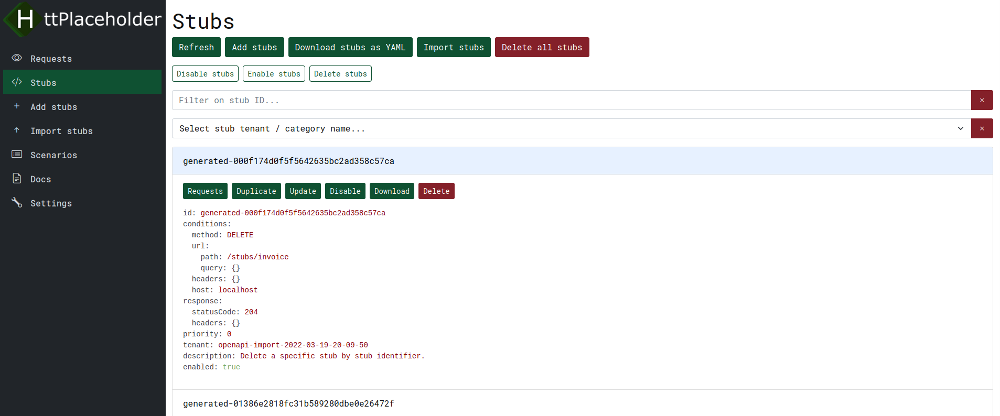

You have several options here.

- Refresh: retrieves all stubs from HttPlaceholder.
- Add stubs: opens a form where you can create new stubs.
- Download stubs as YAML: downloads the current filtered selection of stubs as a YAML file. When no filter is provided, all stubs are downloaded.
- Import stubs: allows you to upload multiple YAML stub files or add stubs in other kinds of ways.
- Delete all stubs: as the name suggests, deletes ALL stubs from HttPlaceholder.
- Disable stubs: disables the current filtered selection of stubs. If no filter is specified, all stubs are disabled.
- Enable stubs: enables the current filtered selection of stubs. If no filter is specified, all stubs are enabled.
- Delete stubs: deletes the current filtered selection of stubs. If no filter is specified, all stubs are deleted.
- Filter on stub ID: filters the stub list on stub ID.
- Tenant / category name: a filter for filtering stubs that are part of a specific tenant (see [tenants](#tenants)).

When clicking on a stub, the stub YAML will be opened and you have a few more stub actions to work with.

- Requests: shows the requests made for this stub.
- Duplicate: copies the contents of the stub and opens them in a new form so you can create a new stub based on this stub.
- Update: opens a form to update this stub.
- Disable / enable: disables or enables this stub.
- Set scenario: opens a form where you can update the variables of the scenario that is linked to this stub. Only available if a scenario has been set on the stub. For more information, read [request scenario](#request-scenario) or [scenario](#scenario).
- Delete: deletes this stub.

## Import stubs

This page allows you to add stubs in different kinds of ways.

### Upload stubs

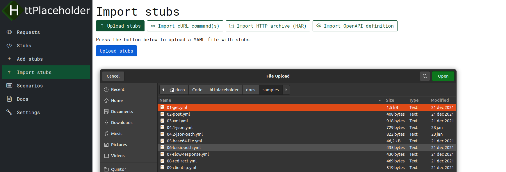

On this page, you can upload stubs you have saved on your PC in YAML format. You can select one or multiple stubs for uploading.

### Import cURL commands

On this page, you can create new stubs based on cURL commands. You can, for example, use cURL commands you have lying around or you can copy/paste cURL commands from your browser.

You can optionally fill in a tenant. All stubs that are created, will be created under this tenant. This is so you can easily see which stubs were imported together. If you do not provide a tenant, a tenant name will be automatically generated.

You can also fill in a stub ID prefix. This is optional. If you fill it in, all stub IDs in the same batch will be prefixed with this string.

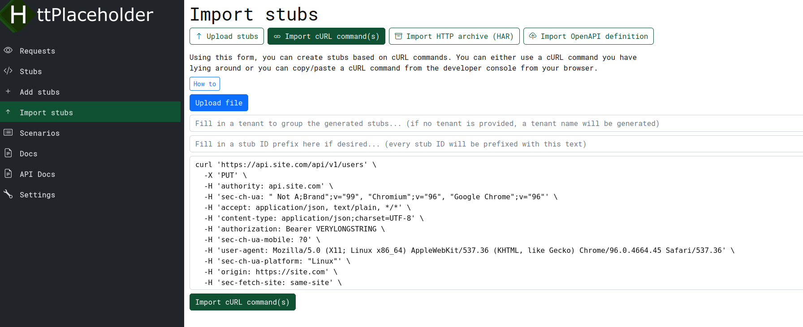
_On this form, you can import one or multiple cURL commands. You can also upload a file with the cURL commands in it._

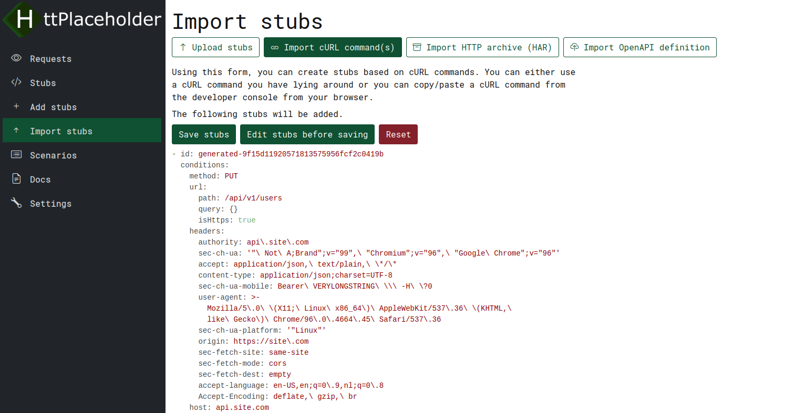
_When pressing the "Import cURL command(s)" button, you will see the stubs that will be added. You will have the option to directly save the stubs, edit the stubs before saving or resetting and starting over._

#### Copying cURL command(s) from browser

Copying cURL commands from browsers is easy and supported in all major browsers (e.g. Firefox, Chrome, Edge etc.). In general, you open the developer console of your browser, go to the "Network" tab and select the command where you would like to copy the cURl command for.

**Firefox**


**Chrome**


Chrome also allows you to copy cURL commands for all requests in the network tab.

**Windows**

When copying cURL requests from a browser on Windows, make sure you select "Copy as cURL (bash)" or "Copy all as cURL (bash)" on Chrome or "Copy as cURL (POSIX)" in Firefox. The Windows formatting of cURL commands is currently not supported in HttPlaceholder.


_Copy as cURL in Firefox on Windows_


_Copy as cURL in Chrome on Windows_

### Import HTTP archive (HAR)

On this page, you can import an HTTP archive (or HAR for short) to create stubs based on it. An HTTP archive file is a JSON file that is a representation of a set of requests with its corresponding response. Most modern browsers allow you to copy or download the HAR file.

You can optionally fill in a tenant. All stubs that are created, will be created under this tenant. This is so you can easily see which stubs were imported together. If you do not provide a tenant, a tenant name will be automatically generated.

You can also fill in a stub ID prefix. This is optional. If you fill it in, all stub IDs in the same batch will be prefixed with this string.

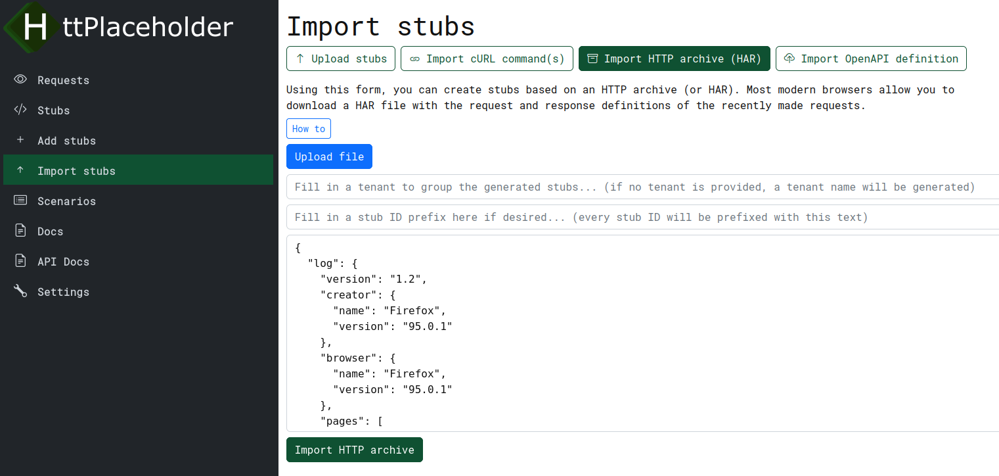
_On this form, you can import a HAR file by pasting the contents of the HAR. You can also upload a HAR file._

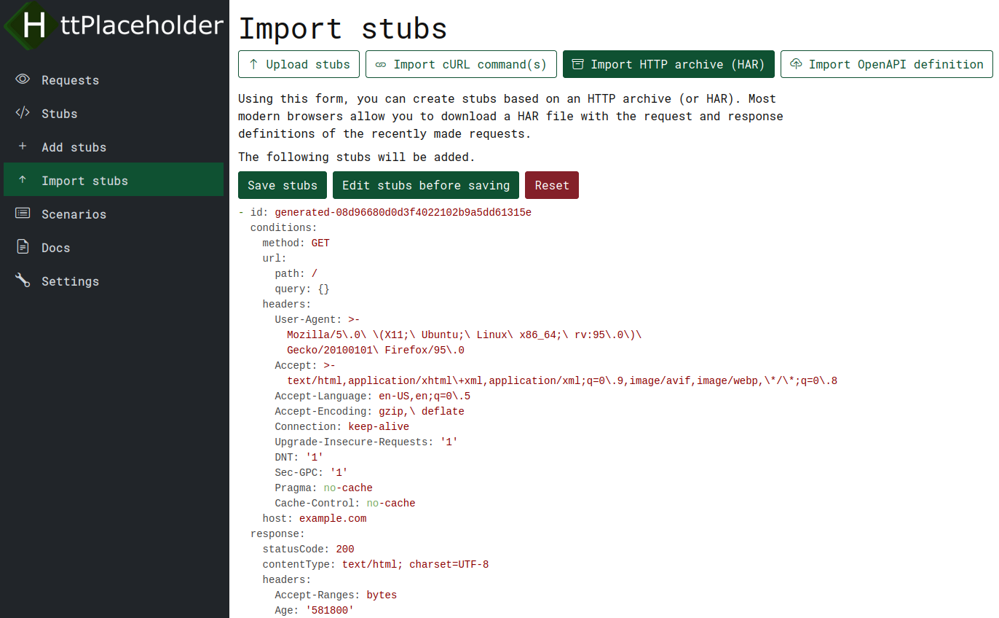
_When pressing the "Import HTTP archive" button, you will see the stubs that will be added. You will have the option to directly save the stubs, edit the stubs before saving or resetting and starting over._

#### Retrieving HAR from browser

Retrieving the HTTP archive from browsers is easy and supported in all major browsers (e.g. Firefox, Chrome, Edge etc.). In general, you open the developer console of your browser, go to the "Network" tab and select the command where you would like to copy the cURl command for.

**Firefox**


_In Firefox, you can right click on the request in the "Network" tab
and select "Copy all as HAR"._

**Chrome**


_In Chrome, you can also click "Copy all as HAR", but this does not
copy the response contents. To get the full responses, you need to
click "Save all as HAR with content" to get the full HAR._

### Import OpenAPI definition

On this page, you can import an [OpenAPI](https://www.openapis.org/) definition. Many modern APIs are accompanied by an OpenAPI definition. This is a JSON or YAML file which contains the definition of a specific API. By importing the OpenAPI definition, HttPlaceholder will create stubs for you so you can start developing against this new API.

You can find some OpenAPI examples here: <https://github.com/OAI/OpenAPI-Specification/tree/main/examples>

You can optionally fill in a tenant. All stubs that are created, will be created under this tenant. This is so you can easily see which stubs were imported together. If you do not provide a tenant, a tenant name will be automatically generated.

You can also fill in a stub ID prefix. This is optional. If you fill it in, all stub IDs in the same batch will be prefixed with this string.

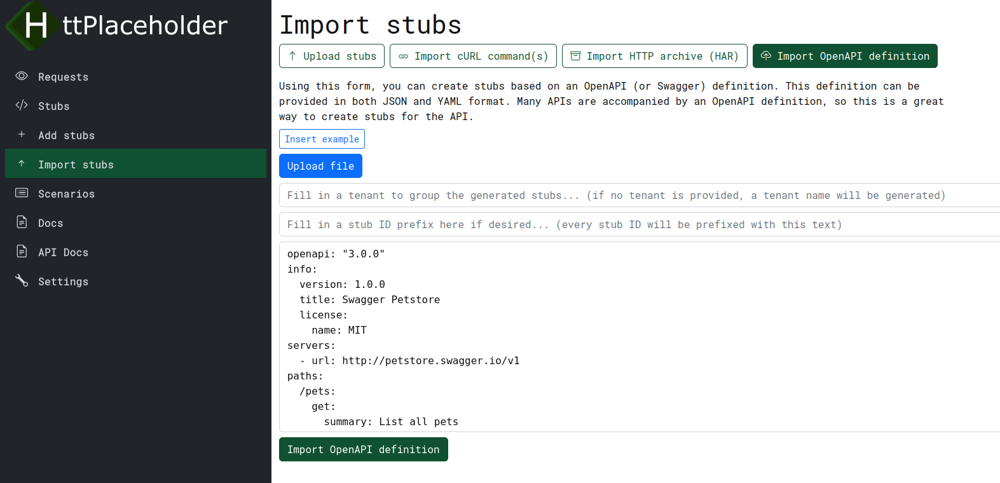
_On this form, you can import an OpenAPI file by pasting the contents of the HAR. You can also upload an OpenAPI file._


_When pressing the "Import OpenAPI definition" button, you will see the stubs that will be added. You will have the option to directly save the stubs, edit the stubs before saving or resetting and starting over._

## Add stub(s) form

You can add stubs in one of three ways: either by filling in the stub YAML, by filling in a form or by uploading a YAML file from your PC.

### Adding stubs as YAML

Click on the "Add stubs" button in the sidebar.

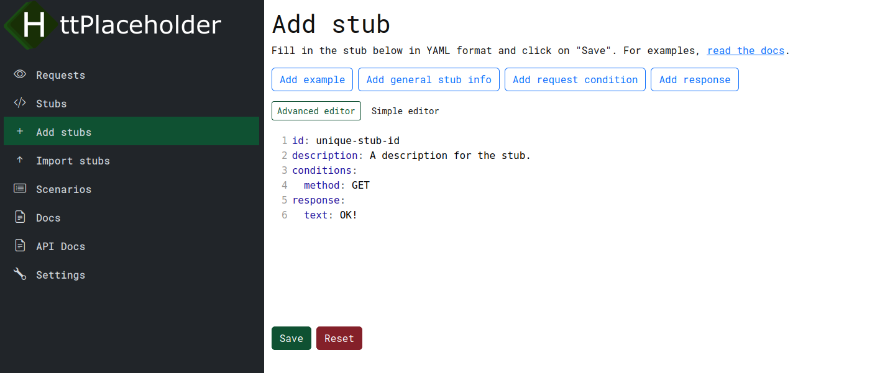

You can add a single stub here or you can provide multiple stubs in YAML format.


You can also click on any of the 4 buttons so you can see what kind of values you can use in your request conditions and response definitions and insert them.

Besides this, you can also choose between using the "Advanced editor" (based on [CodeMirror](https://codemirror.net/)) and "Simple editor". A simple editor was added because CodeMirror is not really suited for updating large stubs.

## Scenarios page

For more information about scenarios, go to [request scenario](#request-scenario) or [scenario](#scenario). In short, this page and form allows you to view the scenarios that are currently in use and add new scenarios and update existing ones.

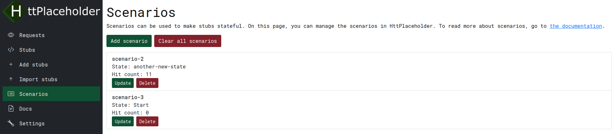

You have several options here.

- Add scenario: opens a form where you can add a new scenario.
- Clear all scenarios: like the name says, deletes all the existing scenarios.

Per scenario, you also have a few options:

- Update: opens a form to update this specific scenario.
- Delete: deletes this specific scenario.

### Scenario form

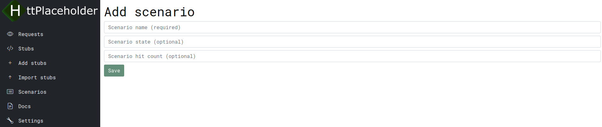

On this form, you can add a new scenario or update an existing scenario. You have a few fields here.

- Scenario: the scenario name.
- State: the state the scenario is currently in (just a piece of text).
- Hit count: the number of hits a stub under this scenario has been hit.

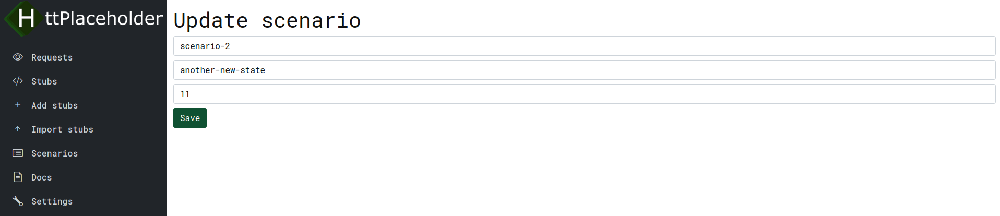

## Settings page

On the settings page you can configure all kinds of settings for HttPlaceholder (only frontend settings for now).

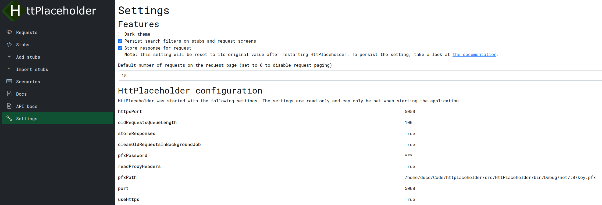

- Dark theme: turns the dark theme on or off.
- Persist search filters on stubs and request screens: when this option is on, the filters on the stubs and is persisted between page navigations.
- Store response for request: whenever this settings is enabled, all the responses that are sent to the client are saved alongside the requests. Clicking this checkbox will send a request to the HttPlaceholder configuration API.
- Default number of requests on the request page. This number determines the number of requests that are loaded by default on the requests page. A "Load more requests" button is shown whenever there are more requests to load. If you set this value to `0`, the paging is disabled and all requests are always loaded.
- View the configuration HttPlaceholder was started with.

# Tools and client libraries

## HttPlaceholder REST API client for .NET

There is a NuGet package available for HttPlaceholder. You can find this client
here: <https://www.nuget.org/packages/HttPlaceholder.Client/>.

### General

This client was built from the ground up. It exposes methods for easily adding the HttPlaceholder client to
the `IServiceCollection` or, if you don't use the .NET Core dependency injection, a factory for easily creating new
client instances.

All methods exposed by the API are available in the client and you can build stub models by using a stub model builder.

### Getting started with the .NET client

You can see some examples in the following
project: <https://github.com/dukeofharen/httplaceholder/tree/master/src/HttPlaceholder.Client.Examples>.

#### When using .NET Core service collection

Use the following code to add the client to your .NET Core application.

```c#
...
public void ConfigureServices(IServiceCollection services)
{
    services.AddHttPlaceholderClient(config => 
    {
        config.RootUrl = "http://localhost:5000/"; // The HttPlaceholder root URL.
        config.Username = "username"; // Optionally set the authentication.
        config.Password = "password";
    })
}
...
```

Now you can inject an object of type `IHttPlaceholderClient` in your class of choice and call the HttPlaceholder API.

#### When not using .NET Core service collection

If you do not use .NET Core or the .NET Core dependency container, use this method to create a new client.

```c#
...
var config = new HttPlaceholderClientConfiguration
{
    RootUrl = "http://localhost:5000", // The HttPlaceholder root URL.
    Username = "username", // Optionally set the authentication.
    Password = "password"
};
var client = HttPlaceholderClientFactory.CreateHttPlaceholderClient(config);
...
```

#### Example: create a new stub

When you've initialized the client, you can call the HttPlaceholder API endpoints. Here is an example for how you add a
simple stub.

```c#
...
var createdStub = await client.CreateStubAsync(new StubDto
{
    Id = "test-stub-123",
    Conditions = new StubConditionsDto
    {
        Method = "GET",
        Url = new StubUrlConditionsDto
        {
            Path = "/test-path"
        }
    },
    Response = new StubResponseDto
    {
        StatusCode = 200,
        Json = @"{""key1"":""val1"", ""key2"":""val2""}"
    }
});
...
```

This method will create the stub and will also return the created stub. Because this way of adding stubs can get very
verbose very quick, another way of adding stubs with the client has been added: the StubBuilder. This is a fluent
builder which can also be used to create new stubs. Here is the same example, but now with using the StubBuilder:

```c#
using static HttPlaceholder.Client.Utilities.DtoExtensions;

...
var createdStub = await client.CreateStubAsync(StubBuilder.Begin()
    .WithId("test-stub-123")
    .WithConditions(StubConditionBuilder.Begin()
        .WithHttpMethod(HttpMethod.Get)
        .WithPath(StringEquals("/test-path"))
    .WithResponse(StubResponseBuilder.Begin()
        .WithHttpStatusCode(HttpStatusCode.Ok)
        .WithJsonBody(new {key1 = "val1", key2 = "val2"})));
...
```

This method is a bit shorter and is more readable.              

#### Stub request validation

It is possible to verify if a certain stub has been hit by a request. The verification method on the client has several overloads which you can use to more broadly or more specifically verify a a stub. The most basic method you can call is this one:

```c#
await client.VerifyStubCalledAsync("stub-id-to-be-checked");
```

Whenever at least one request for this specific stub was made, the method continues like normal. When no requests were made, an exception will be thrown with more details.

Another overload allows you to specify the number of times a request should have been hit. The example below checks if the stub has been hit exactly 3 times. The `TimesModel` class contains more static methods you can use to specify the amount of times a stub should have been hit (or you can instantiate your own TimesModel if you prefer to do so).

```c#
await client.VerifyStubCalledAsync("stub-id-to-be-checked", TimesModel.Exactly(3));
```

Another overload allows you to specify the earliest time the request for a specific stub should been hit. Take a look at the example below. With this verification call, ONLY stubs that are made between now and 10 seconds ago (it is very important to use `UtcNow`, because that's how HttPlaceholder stores the timestamps of the request) are taken into consideration.

```c#
await client.VerifyStubCalledAsync("stub-id-to-be-checked", DateTime.UtcNow.AddSeconds(-10));
```

The last overload is a combination of all the overloads, so you can specify the stub ID, number of times the stub should have been hit and the earliest time the request should have been made.

```c#
await client.VerifyStubCalledAsync("stub-id-to-be-checked", TimesModel.ExactlyOnce(), DateTime.UtcNow.AddSeconds(-10));
```

---

&copy; 2022 [Ducode.org](https://ducode.org) | [HttPlaceholder.org](https://httplaceholder.org)